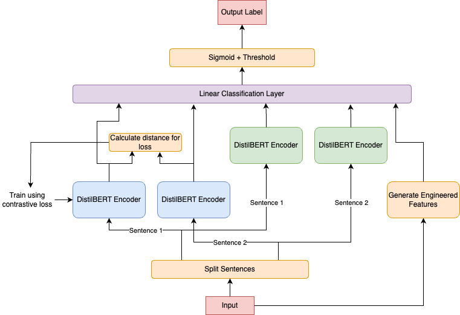

Note: As it stands, I am very unsatisfied with the performance of this model. I believe the design of my model will change significantly by the final version, but right now this is what I have results for.

<table>
  <caption>
    Class Competition Info
  </caption>
  <thead>
  <tr>
    <th></th>
    <th></th>
  </tr>
  </thead>
<tbody>
  <tr>
    <th><b>Leaderboard score</b></th>
    <td>0.484</td>
  </tr>
  <tr>
    <th><b>Leaderboard team name</b></th>
    <td>Amber Converse</td>
  </tr>
  <tr>
    <th><b>Kaggle username</b></th>
    <td>SkitCon</td>
  </tr>
  <tr>
    <th><b>Code Repository URL</b></th>
    <td>https://github.com/uazhlt-ms-program/ling-582-fall-2024-class-competition-code-SkitCon</td>
  </tr>
</tbody>
</table>

## Task summary

The task is to create a binary classifier which takes two sentences separated by a \[SNIPPET\] and classifies them as either 0 (not from the same author) or 1 (from the same author).

My approach to this task was to create a dual encoder[^1] architecture where each sentence is passed through the same DistilBERT network separately (not in the same run with the \[SEP\] token) and the sentence embedding is extracted (the embeddings of the \[CLS\] token). These two embeddings are measured for cosine similarity which is used to calculate the loss.

For this dual encoder architecture, I use contrastive loss as defined below:

$\mathcal{L}_{\operatorname{contrastive}}(D, y) = (1 - y) \cdot (D + 1)^{2} + y \cdot \operatorname{max}(D - 1)^{2}$

where:
* $D$ is the cosine similarity of $\vec{E}_1$ and $\vec{E}_2$ from DeBERTa
* $y$ is the gold label

This loss function is similar to cross-entropy loss, but has the objective of pushing embeddings of sentences from different authors further apart (toward -1) and embeddings of sentences from the same author closer together (toward 1). Thus, the DistilBERT model is fine-tuned to create an embedding space where the same author's work is clustered together, ideally capturing stylistic clusters.

This network is adapted from simple facial recognition systems which use dual encoders to train a system to classify two images as having the same face or not (though in that case Euclidean distance would generally be used).

Once the dual encoder is fine-tuned, the distance fine-tuned model is frozen and added to the pipeline of the final model. In the final model, sentences are fed through both the frozen dual encoder architecture and another DistilBERT model to generate semantic sentence embeddings for a final linear layer which takes the distance embeddings and semantic embeddings as input and 6 engineered features (discussed below) as input. This model is trained with binary cross-entropy loss, but the distance embeddings are frozen to retain the style embedding space. The architecture diagram is shown below:

Both models are trained with mini-batch gradient descent with an Adam optimizer. The dual encoder was trained with 20 epochs and a batch size of 32. The main layer was trained with 5 epochs and a batch size of 16. To deal with class imbalance and overfitting, the positive class was given a weight of 4.0 in the BNE loss calculation and weight decay was set 0.01.

I went with DistilBERT over other LLMs because it is faster, uses less memory (allows for larger batch size), and seems to generalize slightly better (further suggesting overfitting with two many parameters).

[^1]: Note: This is also called a "Siamese Network" if you have heard of that, but this term is insensitive, so I will use the term dual encoder for this writeup.

### Engineered Features

Based on my exploratory data analysis, I included 6 engineered features which come from 2 sources: the proportion of words that are nouns in the sentence and the proportion of words in the sentence which are not in the 5,000 most common words in English (which I call rarity in this writeup). The 6 features are:
 
* From noun proportion:
  * Noun proportion in sentence 1
  * Noun proportion in sentence 2
  * Difference in noun proportion between sentence 1 and 2
From rarity:
  * Rarity of sentence 1
  * Rarity of sentence 2
  * Difference in rarity between sentence 1 and 2

## Exploratory data analysis

For my initial exploratory data analysis, I analyzed the difference of 6 candidate features between sentence 1 and sentence 2. For example, I extracted the proportion of words in each sentence that are nouns and calculated the difference between sentence 1 and sentence 2. I treated each label as a separate experimental condition and performed a 2-sample t-test on the differences for each feature between label 0 (different author) and label 1 (same author).

"Rarity" is a metric meant to measure the vocabulary richness of the sentence. It is defined as the proportion of words in the sentence that are not in the 5,000 most common words of English.

| Label	| Mean Noun Prop Diff |	Mean Verb Prop Diff | Mean Adj Prop Diff | Mean Adv Prop Diff	| Mean Unique Lemma Prop Diff |	Mean Rarity Diff |
| --- | --- | --- | --- | --- | --- | --- |
| 0	| 0.056584** |	0.033573*	| 0.032808	| 0.030204	| 0.087326 | 0.073939\*\*\* |
| 1	| 0.048409	| 0.030722	| 0.032298	| 0.028616	| 0.081799	| 0.058139 |

p-value from 2-sample t\-test reported as: \* - p \< 0.1, \*\* p \< 0.05, \*\*\* - p \< 0.01

From this, I decided to include the proportion of words in the sentence that are nouns and rarity score as manually-engineered features for the model.

## Results

As of right now, the performance of this network is much lower than expected. While it of course performs extremely well on training data because these are seen examples, the embedding space does not generalize well to unseen authors and styles.

To be honest, I am very disappointed with these results as my first draft, but I have run out of time before the draft is due. I unfortunately wasted time trying to fine-tune DeBERTa v3 XL only to find that its performance is worse.

On the test set:

* Accuracy: 0.469
* Precision: 0.252
* Recall: 0.492
* F1: 0.333

## Error analysis

The key evidence that the embeddings space does not generalize well to new authors is that in the training data, the mean cosine similarity of two distance embeddings from the same author is almost 1 and the mean cosine similarity of two distance embeddings from two different authors is a little less than 0. However, in the development set I found that the mean cosine similarities are very close, -0.02 for two different authors and 0.27 for the same author. Therefore, this design is currently overfitting. While I think this design makes sense, I think it requires much more data and more examples of different styles to reach a generalizable embedding space and overall model.

For the overall model, here is the confusion matrix on the test set:

| | Gold 1 | Gold 0 |
| ---- | ---- | ---- |
| Pred 1 | 32 | 95 |
| Pred 0 | 81 | 33 |

The model has very poor scores on all metrics. I plan to do a manual analysis of the sentence pairs which are FP and FN, because they seem to be the exact same sentences. Whenever I adjust hyperparameters, it generally just moves a few specific sentences around with little effect on the model (unless I change them to something unreasonable, then the model gets much much worse).

## Reproducibility

Dependencies and reproduction code are available on the Github repo for this project: https://github.com/uazhlt-ms-program/ling-582-fall-2024-class-competition-code-SkitCon

## Future Improvements

The first thing I need to do is augment the dataset through data mining of more books and articles. Secondly, If this strategy work, I believe I will need to completely rethink this architecture. I think perhaps there are too many features which is causing the overfitting, but I am not sure the right approach to finding the sweet spot as this is still a complex task.

I think perhaps the right approach is possibly to reduce the size of the model and focus more on other engineered features like overlap of high scoring terms on TF-IDF.
