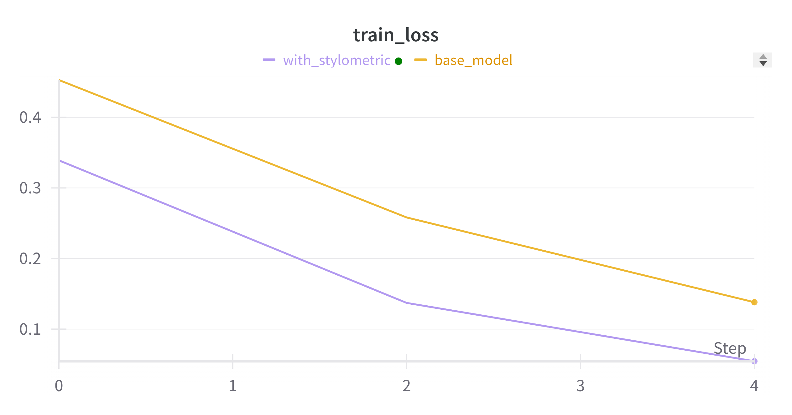
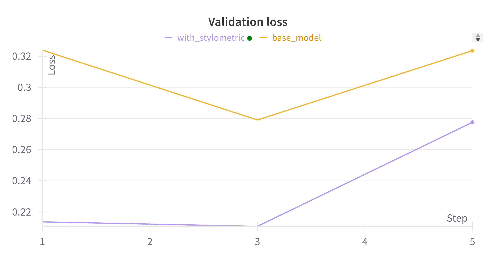
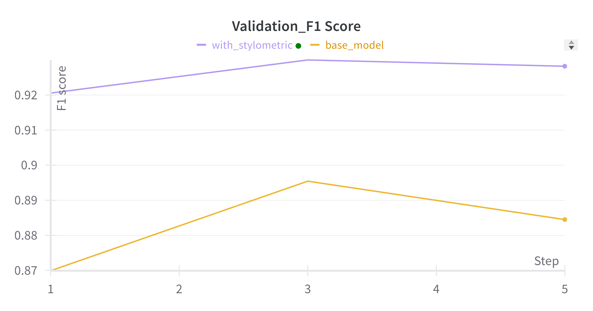
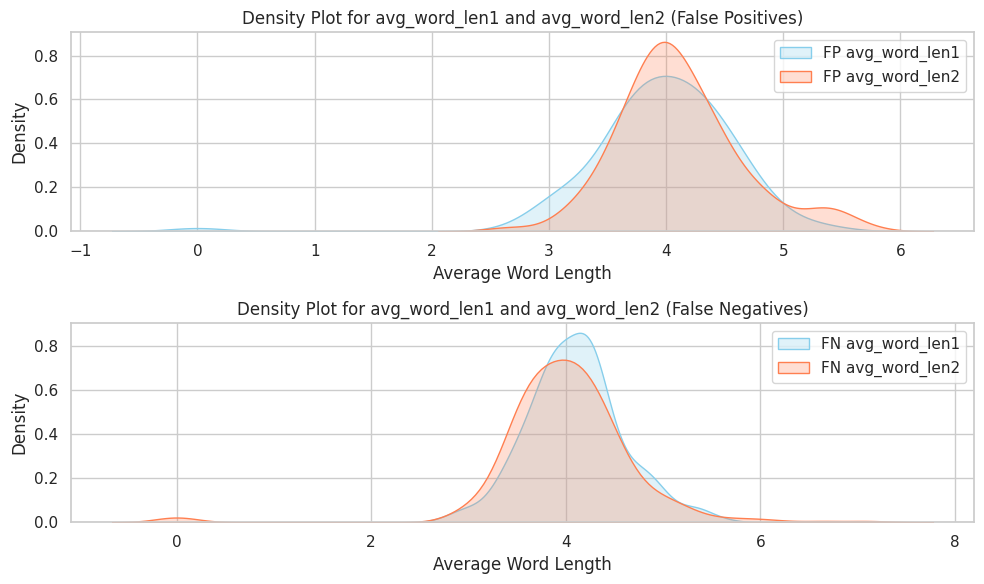
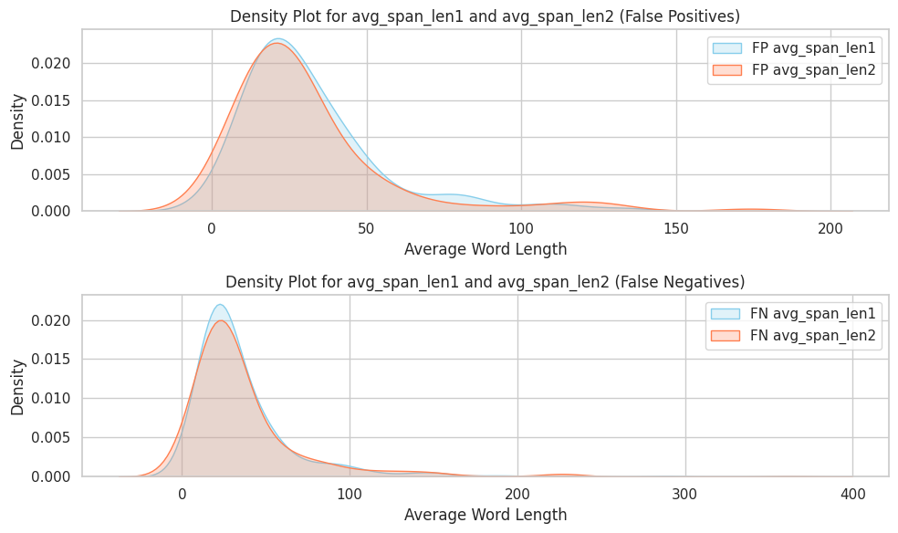

<table>
  <caption>
    Class Competition Info
  </caption>
  <thead>
  <tr>
    <th></th>
    <th></th>
  </tr>
  </thead>
<tbody>
  <tr>
    <th><b>Leaderboard score</b></th>
    <td>0.63940</td>
  </tr>
  <tr>
    <th><b>Leaderboard team name</b></th>
    <td>Ki Woong Moon</td>
  </tr>
  <tr>
    <th><b>Kaggle username</b></th>
    <td>Ki Woong Moon (kiwoong0325)</td>
  </tr>
  <tr>
    <th><b>Code Repository URL</b></th>
    <td>https://github.com/uazhlt-ms-program/ling-582-fall-2024-class-competition-code-Ki-Woong95</td>
  </tr>
</tbody>
</table>

## Task summary
The class competition tasks involves predicting whether the given two spans in TEXT columns are written by the same author or not. 
The task is basically binary classification, requiring given token to be classified as follows:
- `0` : Two spans provided in the token are written by the same author
- `1` : Two spans provided in the token are writteb by different authors.

The main point of the current project is to capture the stylistic metrics of each author, and utilize these features into models to properly classify the given texts.

_See [the rubric](https://parsertongue.org/courses/snlp-2/assignments/rubrics/class-competition/final/#task-summary)_
___

## Exploratory data analysis

### Original Dataset
The original dataset which consists of English text samples with labels indicating whether the two spans in the text samples are written by the same author or not.
The dataset is primarily sourced from [Project Gutenberg](https://www.gutenberg.org/)
Each token in train.csv and test.csv has `ID` , `TEXT`, and for the training datset, it has `LABEL`.
The length of the texts vary in both training datset and text datset.
In each token, two spans are separated by a delimiter '[SNIPPET]' 

Example of text in the dataset:  
"A flat yes or no," said Bal. "No. We can\'t help them," said Ethaniel. " 
There is nothing we can do for them—but we have to try." "Sure, I knew it before we started," 
said Bal. " It\'s happened before. We take the trouble to find out what a people are like and when we can\'t help them we feel bad. It\'s going to be that way again." 
`[SNIPPET]` 
Little had been gained, little proven; the perilous thing was still there, that monstrous means of death that might come in a moment of temper or reprisal to either tribe. Alas, such weapons were not easily relinquished—and who would be first? Plainly, the way would now be slow and heavy with suspicion, but a method to abate such a threat must soon be formulated. On that Otah and Kurho were agreed! So the two great leaders agreed, and were patient, and twice more there were meetings.

### Datafiles
- `train.csv` (1.71 MB) : 1,601 rows with columns `ID` (dtype = int64, 0 - 1599 & 1999), `TEXT` (dtype = object, max length = 925), `LABEL` (dtype = int64, `0`: 1245, `1`: 356). 
- `test.csv` (917.2 kB) :  899 rows with columns `ID` (dtype = int64, 1600 - 2499 without 1999) `TEXT` (dtype = object), max_length = 1714
- `sample_submission.csv` (6.3 kB):  899 rows with columns `ID` (int64, 1600 to 2499 without 1999), `LABEL` (int64, 0 (682) or 1 (217)).

### Augmented Dataset
Since the amount of provided training data is too small, I tried to augment dataset using 6 different books that can be found in Project Gutenberg.
These books are stored in the directory `gutenberg`. Using the script `gutenberg/scripts/gutenberg_scrapping.ipynb`, I created an augmented datset which has about 33% of mismatched pairs.

- `gutenberg_author_pairs.csv` (9.2 MB): 26,596 rows with columns `ID` (dtype = int64, 2000 - 28595), 
`TEXT` (dtype = object, max_length = 232), `LABEL` (dtype = int64, `0`: 10638 , `1` : 15958)

After creating the augmented dataset, the total number of training data was 28,193 (`0`: 11883 `1`: 16314) 

_See [the rubric](https://parsertongue.org/courses/snlp-2/assignments/rubrics/class-competition/final/#exploratory-data-analysis)_
___
## Methods

In this project, I used the pre-trained BERT tokenizer ('bert-based-uncased') and BERTForSequenceClassification ('bert-based-uncased').
Without the augmented datset, the model showed a slightly lower F1 score (0.53) and high training and validation loss (training loss : 0.53, validation loss : 0.53).
Since the performance of the pre-trained BERT model was low with the original dataset, I merged the original training set and augmented dataset to increase the number of items per each label.
In the original training set, there was an uneven distribution between each label (`0`: 1245, `1`: 356).
To solve this uneven distribution, augemented data had 66% of tokens that were written by the same author, and 33% of tokens that were written by different authors.
 

### Preprocessing

Before preprocessing `TEXT` columns, the study first separated two spans 
which were separated by the delimiter `[SNIPPET]` . Preprocessing of each span was done by using the Python library *Spacy*.
During the preprocessing, each word in each span was transformed into its lemma. Punctuations and stop words were also removed during the preprocessing.

### Stylometric features
In addition to increasing the number of training data, the project utilized feature engineering method to enhance the performance of the model. 
Based on the paper which fine-tuned BERT model for Authorship Attribution (https://aclanthology.org/2020.icon-main.16.pdf), the project extracted three stylometric for each span:
- **average word length**: The mean number of characters per word in a span
- **average span length**: The average number of words in a span
- **punctuation frequency**: The number of punctuation marks per unit of text.

This extraction was done using the Python library *Spacy* with creating a function called `extract_stylometric_features`.
In the extraction process, the raw spans were used as the prerpocessing removed the stop words, and punctuations.
The 6 stylometric features (3 for each span) were passed through a fully connected layer with reduced dimension of 32. The final classification layer concatenates the output from
BERT(768 dimensional embeddings for the [CLS] token) with the 32 dimensional stylometric features.
This combined representation is then passed through a classifier to predict whether given two spans are written by the same author or not. 

### Training and Validation
The training data was divided into training set and validation set (validation size : 20%). 
The total number of training set was 22,557 and the total number of validation set was 5,640.

#### Optimizer and hyper parameters:
    - optimizer: AdamW
    - learning rate: 2e-5
    - epochs: 3
    - batch_size: 8
    - max_length: 512

#### Validation
After each epoch, the model is evaluated on the validation datset to track performance.
The model's predictions are compared to the true labels in the validation set to calculate metrics such as F1 score.

Throughout the training and evaluation process, relevant metrics (loss and accuracy) are logged to WandB to visualize the model's performance.

___
## Results

### Results of based and stylometric model with augmented data

  
  
  

As shown in the figures, the stylometric model performed better than the base model with the augemented data.

| Model               | Validation Loss | Validation F1 Score | Test F1 Score |
|---------------------|-----------------|---------------------|---------------|
| Base Model          | 0.3235          | 0.8845              | 0.63627       |
| Stylometric Model   | 0.2193          | 0.9350              | 0.63940       |

The results of the testing suggest that BERT model with the stylometric features performed better than the base BERT model.

_See [the rubric][def]_

## Error analysis
During the validation phase, classification errors were collected. Among 5,640 validation tokens, the model misclassified 448 tokens.
The number of false negative in the misclassified items was 335(74.78%), and the number of false positive in the misclassified items was 113 (25.22%)
The result of false negative and false positive ratio suggests that the model tends to miss tokens from the positive class (two spans written by the same author) more often
than incorrectly classifying tokens from the negative class (two spans written by differnt authors).
This indicates that the model may not be sensitive enough to correctly identify the similarities between spans that are written by the same author.

In addition to analyzing the ratio of false negative and false positive, analysis on the distribution of stylometric features such as the average word length and the average span length was conducted.

  
  

The density plots for both the average word length and average span legnth revealed patterns in the distribution of stylometric
features among false positive (FP) and fasle negative (FN).
For average word length, the density plots show a similar trend. Among false positives, the distribution of `avg_word_len1` and `avg_word_len2` closely overlap with a peak around 4, indicating 
a consistency in word length for spans misclassified as written by different authors. However, the false negatives showed
slightly broader distributions, suggesting that the model has difficulty 
distinguishing between spans with little variations in word length when spans are written by the same author. 
For average span length, the plots for false positive show huge overlap between `avg_span_len1` and `avg_span_len2` with a sharp peak indicating that
most misclassified spans in this category are relatively short. This suggests that spans classified as false positives have similar
lengths regardless of whether they belong to `span1` or `span2`. For false negatives, the distributions also overlap but has slightly more variability.
This indicates that the model struggles to consistently identify spans of varying length when they are written by the same author.

Based on the analyses, both stylometric features may not differentiate between spans written by the same or different authors.

_See [the rubric](https://parsertongue.org/courses/snlp-2/assignments/rubrics/class-competition/final/#error-analysis)_

## Reproducibility
Details of the methods and requirements are listed in the README.md on https://github.com/uazhlt-ms-program/ling-582-fall-2024-class-competition-code-Ki-Woong95
_See [the rubric](https://parsertongue.org/courses/snlp-2/assignments/rubrics/class-competition/final/#reproducibility)_
_If you'ved covered this in your code repository's README, you can simply link to that document with a note._

## Future Improvements

The current project examined whether stylometric features such as average word length, average span length and frequncy of punctuation could help model which classifies whether
given two spans are written by the same author or not. The error analysis suggested that these stylometric features show overlap between each span's distribution, indicating that these features
may not increase the performance of the model significantly. As reported in https://aclanthology.org/2020.icon-main.16.pdf), the model which incorporated stylometric only showed 2.7% increase in F1 score.

Future work could explore incorporating more complex stylometric or semantic features. Also, augmenting more data to solve the imbalanced distribution between each label would help the model. 
_Describe how you might best improve your approach_

[def]: https://parsertongue.org/courses/snlp-2/assignments/rubrics/class-competition/final/#results
