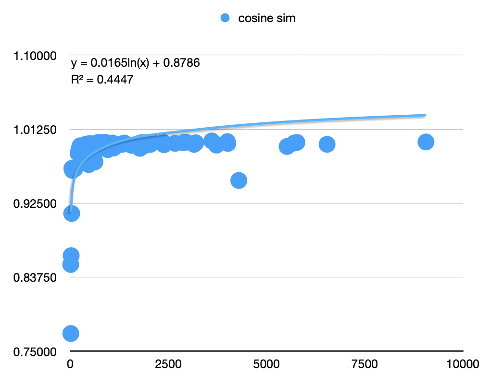
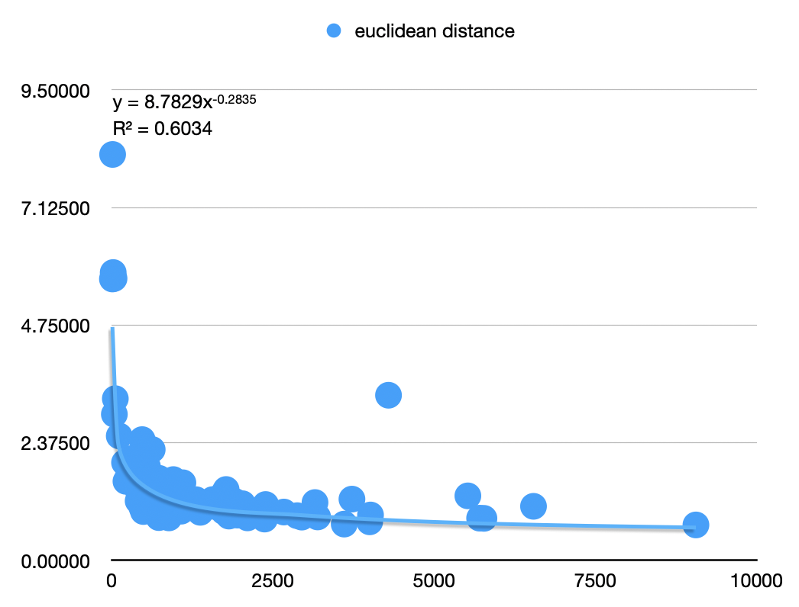
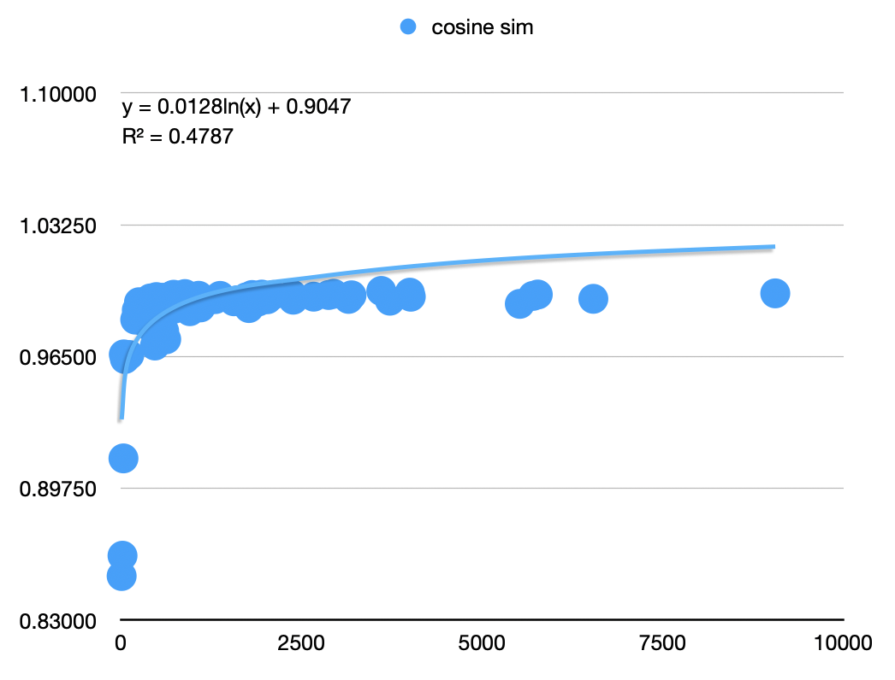
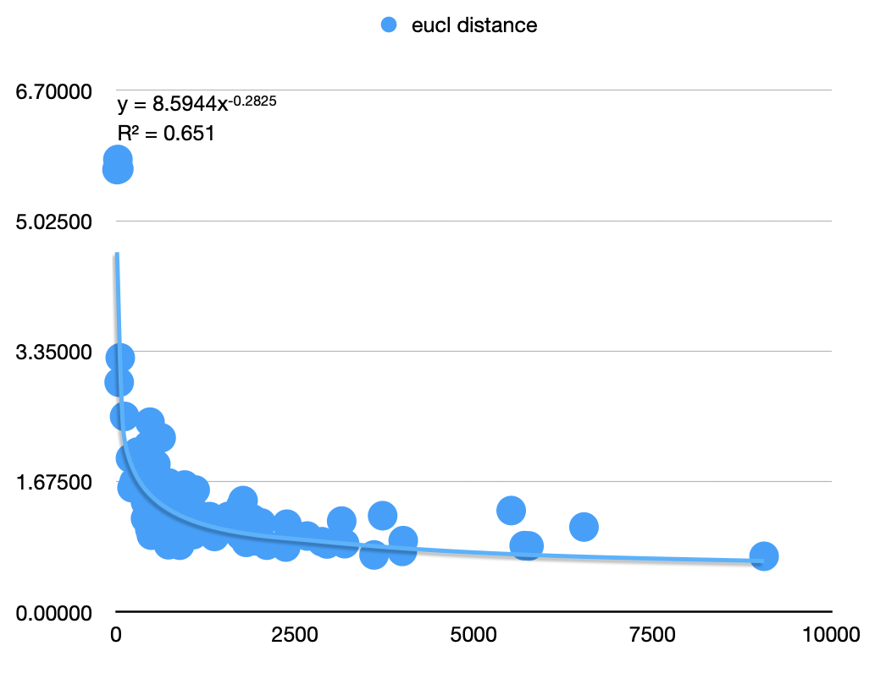
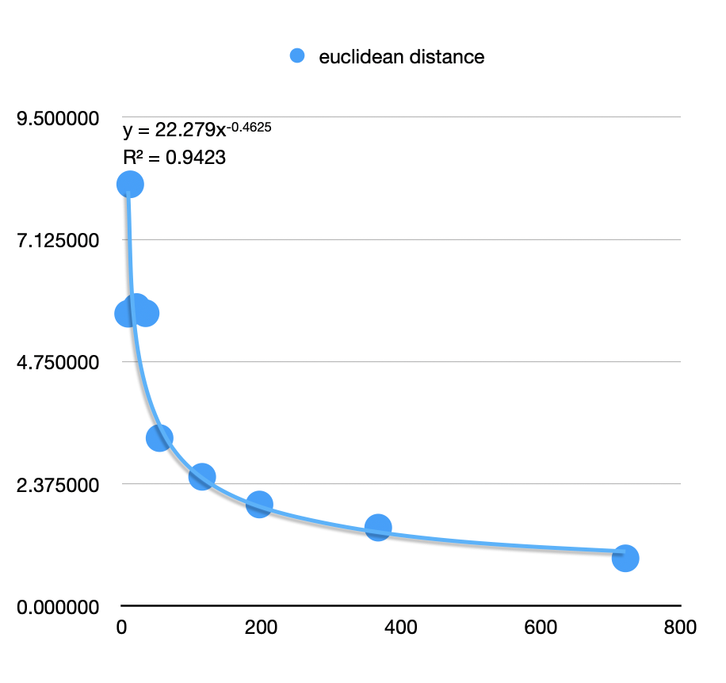

<table>
  <caption>
    Course Project Info
  </caption>
<tbody>
  <tr>
    <th>Code Repository URL</th>
    <td>https://github.com/uazhlt-ms-program/ling-582-fall-2024-course-project-code-lynette</td>
  </tr>
  <tr>
    <th>Demo URL (optional)</th>
    <td></td>
  </tr>
  <tr>
    <th>Team name</th>
    <td>Feline Foliage Friends</td>
  </tr>
</tbody></table>


[Code repository link](https://github.com/uazhlt-ms-program/ling-582-fall-2024-course-project-code-lynette) (for convenience)

## Project description

This project explores the shift in the context of words used in TED talks over time. In the paper [Diachronic Word Embeddings Reveal Statistical Laws of Semantic Change](https://arxiv.org/pdf/1605.09096) Hamilton, Leskovec, and Jurafsky demonstrate a method for quantifying semantic shift using three different word embeddings that were state of the art in 2018: PPMI, SVD, and word2vec. Following their example we use contextual embeddings with a pre-trained transformer to quantify a topical shift in words used in TED Talks. Questions we attempt to answer are: 
 - Did words such as "climate", "society", "technology", "health", or "[laughter](https://www.inc.com/bill-murphy-jr/the-25-most-popular-ted-talks-include-this-1-surprising-word-over-over-reason-why-is-eye-opening.html)" change their contextual relationships even over a short period of time? 
  - Can a pre-trained transformer detect this change using contextual embeddings?
  -  Do any contextual shifts correlate with the *law of conformity* as described by [Hamilton, Leskovec, and Jurafsky](https://arxiv.org/pdf/1605.09096): the rate of semantic change scales with an inverse power-law of word frequency?

Surprisingly, we find evidence that contextual embeddings do follow the law of conformity even over a short period of time, and our method also reflects known historical shifts. We posit that this shift in contextual embeddings represents a topical rather than semantic change, but this does not explain why our results also conform to known historic shifts in semantic space.

### Motivation

There are many similar papers to one by Hamilton, Leskovec, and Jurafsky, but as far as we could determine this is the first project to attempt to measure semantic shift using contextual embeddings from TED Talks. Our motivation for the project was to determine whether modern LLM models could provide useful methods for studying linguistic trends such as semantic change.

### Corpuses

Our TED Talk data comes from the Kaggle dataset [here](https://www.kaggle.com/datasets/rounakbanik/ted-talks) which includes 2,467 transcripts. We selected transcripts from talks that were nine years apart to create two corpuses: talks recorded 2001-2007 ('early talks') and talks recorded 2016-2017 ('late talks'). The early talks corpus comprises 315 transcripts with 47,604 sentences; the late talks corpus comprises 342 sentences with 34,500 sentences. We hand selected words to embed in several phases, initially choosing content words common to both corpuses (including "climate", "society", "technology", "health", and "laughter") and then adding  stop words to fill out the frequency distribution of our data. (There simply aren't many content words that appear more than 5,000 times over both corpuses.) Finally, to evaluate our method we tested the same nine words with attested historical shifts that  Hamilton, Leskovec, and Jurafsky did. Following are all 197 words for which we computed contextual embeddings: 
```
able, across, all, almost, also, always, awful, back, bad, believe, best, better, body, brain, broadcast, build, call, change, city, climate, coming, company, could, country, course, create, culture, data, day, design, different, do, done, earth, example, experience, fact, false, fatal, feel, future, gay, getting, give, global, go, going, good, got, great, guy, happened, health, help, here, history, hope, human, idea, imagine, important, information, kids, know, knowledge, laughter, less, let, life, like, live, long, look, love, makes, man, many, means, million, money, monitor, much, nice, nothing, number, one, open, out, part, people, percent, play, point, power, probably, problem, project, put, question, real, record, right, room, saw, saying, school, science, see, seen, sense, simple, society, something, space, start, still, story, system, take, talk, talking, technology, think, thinking, took, true, try, understand, using, way, ways, well, whole, work, working, world, year
```


### Contextual embedding algorithm

We used BERT (base-uncased) to generate the contextual word embeddings. Since BERT generates embeddings for sentences only, one challenge was determining how to define an embedding for a single word. For this we used an average of all the embeddings for a word; that is, we generated an embedding for every instance of the word and then averaged these embeddings to create a single vector to represent that word. This was done separately using the early talk and late talk corpuses to create two vectors, and then differences in the vectors were measured using cosine similarity and euclidean distance. The resulting statistics are described below in Results.


## Summary of individual contributions
<table>
  <thead>
  <tr>
    <th>Team member</th>
    <th>Role/contributions</th>
  </tr>
  </thead>
<tbody>
  <tr>
    <th><b>Lynette</b></th>
    <td>100%</td>
  </tr>
  <tr>
    <th><b>cats</b></th>
    <td>distraction and moral support</td>
  </tr>
  <tr>
    <th><b>houseplants</b></th>
    <td>oxygen</td>
  </tr>
</tbody>
</table>

To quote David Bentley Hart: without my cats' assistance, this project would have been completed in half the time.


## Results

The raw statistics generated by our contextual embeddings are given in the following table, where '#early' represents the number of occurrences in the early talks, '#late' is the number of occurrences in the late talks, and '#total' is their sum. The table data is in descending order by total number of word occurrences. 
|word       |#early|#late|#total|cosine sim|eucl distance|
|-----------|------|-----|------|----------|-------------|
|do         |5405  |3654 |9059  |0.99734   |0.71588      |
|all        |3759  |2781 |6540  |0.99454   |1.09175      |
|people     |3008  |2763 |5771  |0.99676   |0.84877      |
|one        |3402  |2302 |5704  |0.99603   |0.85267      |
|like       |2943  |2579 |5522  |0.99196   |1.30293      |
|know       |2892  |1399 |4291  |0.95183   |3.33424      |
|out        |2435  |1577 |4012  |0.99562   |0.91682      |
|going      |2607  |1392 |3999  |0.99769   |0.77865      |
|think      |2289  |1435 |3724  |0.99359   |1.23715      |
|laughter   |2193  |1411 |3604  |0.99857   |0.73299      |
|see        |1907  |1285 |3192  |0.99635   |0.87747      |
|here       |2141  |1010 |3151  |0.99450   |1.16796      |
|world      |1631  |1315 |2946  |0.99710   |0.87377      |
|could      |1548  |1327 |2875  |0.99650   |0.90314      |
|way        |1534  |1134 |2668  |0.99564   |0.97629      |
|right      |1321  |1064 |2385  |0.99410   |1.12823      |
|go         |1551  |818  |2369  |0.99672   |0.83424      |
|something  |1274  |830  |2104  |0.99652   |0.85866      |
|well       |1259  |767  |2026  |0.99432   |1.14389      |
|much       |1141  |808  |1949  |0.99671   |0.91417      |
|got        |1281  |623  |1904  |0.99321   |1.19438      |
|look       |1091  |725  |1816  |0.99650   |0.89443      |
|work       |925   |847  |1772  |0.98981   |1.43122      |
|also       |892   |848  |1740  |0.99215   |1.35990      |
|back       |1047  |688  |1735  |0.99532   |0.98460      |
|life       |942   |762  |1704  |0.99243   |1.26909      |
|many       |817   |881  |1698  |0.99404   |1.15680      |
|take       |835   |768  |1603  |0.99379   |1.08732      |
|good       |984   |579  |1563  |0.99329   |1.22696      |
|different  |769   |603  |1372  |0.99605   |0.97045      |
|let        |646   |660  |1306  |0.99440   |1.22535      |
|put        |824   |380  |1204  |0.99377   |1.12993      |
|day        |586   |615  |1201  |0.99427   |1.18249      |
|talk       |707   |395  |1102  |0.99015   |1.56740      |
|human      |519   |556  |1075  |0.99610   |0.99359      |
|percent    |557   |493  |1050  |0.99380   |1.34521      |
|better     |540   |462  |1002  |0.99102   |1.44048      |
|idea       |591   |395  |986   |0.99502   |1.04213      |
|year       |562   |408  |970   |0.99506   |1.07118      |
|change     |469   |485  |954   |0.98821   |1.63150      |
|fact       |538   |388  |926   |0.99007   |1.55837      |
|still      |453   |463  |916   |0.99537   |1.10223      |
|give       |527   |377  |904   |0.99463   |1.08559      |
|great      |565   |339  |904   |0.99468   |1.08073      |
|important  |500   |385  |885   |0.99699   |0.85835      |
|technology |484   |342  |826   |0.99620   |0.97859      |
|problem    |433   |374  |807   |0.99600   |1.01454      |
|start      |458   |347  |805   |0.99451   |1.16182      |
|part       |441   |361  |802   |0.99269   |1.26012      |
|love       |426   |375  |801   |0.99189   |1.32094      |
|able       |436   |359  |795   |0.99606   |1.02771      |
|feel       |366   |402  |768   |0.99287   |1.26530      |
|always     |420   |346  |766   |0.99554   |1.03167      |
|long       |431   |333  |764   |0.99430   |1.16698      |
|real       |422   |323  |745   |0.99318   |1.25539      |
|help       |314   |430  |744   |0.99166   |1.35131      |
|course     |485   |257  |742   |0.99446   |1.27128      |
|whole      |503   |237  |740   |0.99200   |1.45049      |
|brain      |380   |358  |738   |0.99602   |1.13576      |
|system     |428   |308  |736   |0.99042   |1.41623      |
|million    |465   |268  |733   |0.98943   |1.65647      |
|live       |345   |384  |729   |0.99664   |0.86395      |
|call       |383   |338  |721   |0.99695   |0.92812      |
|point      |426   |292  |718   |0.99476   |1.09853      |
|question   |360   |352  |712   |0.99510   |1.19374      |
|understand |378   |327  |705   |0.99613   |0.96890      |
|done       |431   |266  |697   |0.99083   |1.40124      |
|design     |510   |186  |696   |0.99061   |1.46957      |
|believe    |362   |330  |692   |0.99362   |1.24633      |
|story      |367   |323  |690   |0.99583   |0.95662      |
|try        |441   |241  |682   |0.99329   |1.25020      |
|country    |296   |382  |678   |0.99268   |1.33851      |
|working    |370   |306  |676   |0.99108   |1.37427      |
|example    |350   |325  |675   |0.99134   |1.62065      |
|money      |383   |255  |638   |0.99339   |1.34468      |
|data       |234   |402  |636   |0.98959   |1.61563      |
|getting    |375   |255  |630   |0.99293   |1.16981      |
|took       |369   |261  |630   |0.99287   |1.22045      |
|thinking   |354   |274  |628   |0.99333   |1.20697      |
|future     |284   |342  |626   |0.99456   |1.30247      |
|number     |353   |273  |626   |0.97383   |2.23746      |
|means      |278   |326  |604   |0.99440   |1.17874      |
|kids       |348   |255  |603   |0.99473   |1.17297      |
|using      |293   |304  |597   |0.99507   |1.01805      |
|sense      |355   |242  |597   |0.97811   |2.23287      |
|space      |353   |239  |592   |0.99099   |1.47993      |
|talking    |335   |248  |583   |0.99420   |1.21215      |
|probably   |344   |218  |562   |0.98994   |1.72126      |
|best       |290   |270  |560   |0.99327   |1.19698      |
|school     |273   |279  |552   |0.99488   |1.13730      |
|man        |333   |219  |552   |0.98424   |1.89642      |
|less       |268   |268  |536   |0.98355   |1.89997      |
|build      |279   |250  |529   |0.99239   |1.31978      |
|create     |253   |275  |528   |0.99504   |1.05629      |
|city       |281   |247  |528   |0.99216   |1.41117      |
|earth      |329   |196  |525   |0.99258   |1.43512      |
|experience |255   |256  |511   |0.98813   |1.53846      |
|information|248   |255  |503   |0.99289   |1.27217      |
|coming     |315   |186  |501   |0.98760   |1.54936      |
|power      |255   |242  |497   |0.99061   |1.38134      |
|imagine    |239   |254  |493   |0.98924   |1.57186      |
|saying     |287   |203  |490   |0.99544   |0.98660      |
|science    |301   |180  |481   |0.99304   |1.35440      |
|almost     |242   |235  |477   |0.99342   |1.27801      |
|ways       |237   |234  |471   |0.99212   |1.44655      |
|across     |228   |242  |470   |0.97062   |2.43838      |
|history    |220   |248  |468   |0.99485   |1.06389      |
|health     |172   |288  |460   |0.98606   |2.01914      |
|body       |221   |238  |459   |0.99076   |1.45087      |
|happened   |283   |175  |458   |0.99006   |1.65415      |
|project    |274   |179  |453   |0.99335   |1.19607      |
|seen       |268   |185  |453   |0.98790   |1.64719      |
|global     |159   |288  |447   |0.98492   |2.14128      |
|makes      |243   |202  |445   |0.99194   |1.48803      |
|room       |255   |189  |444   |0.99302   |1.29441      |
|nothing    |246   |193  |439   |0.99143   |1.39144      |
|simple     |248   |191  |439   |0.99211   |1.37815      |
|bad        |255   |172  |427   |0.98936   |1.60018      |
|play       |240   |183  |423   |0.98540   |1.81063      |
|saw        |223   |192  |415   |0.99074   |1.43395      |
|open       |216   |199  |415   |0.97992   |1.98551      |
|true       |229   |179  |408   |0.99475   |1.20068      |
|company    |228   |180  |408   |0.99115   |1.41319      |
|hope       |222   |172  |394   |0.98382   |1.99844      |
|guy        |275   |92   |367   |0.99125   |1.52478      |
|society    |145   |151  |296   |0.98332   |2.05456      |
|climate    |76    |173  |249   |0.99281   |1.67353      |
|culture    |130   |108  |238   |0.98830   |1.62190      |
|knowledge  |107   |112  |219   |0.98879   |1.59611      |
|nice       |136   |61   |197   |0.98390   |1.97435      |
|record     |50    |65   |115   |0.96578   |2.51198      |
|awful      |40    |14   |54    |0.96371   |3.26439      |
|false      |13    |26   |39    |0.96609   |2.94994      |
|gay        |2     |32   |34    |0.91282   |5.69061      |
|monitor    |11    |10   |21    |0.86298   |5.81119      |
|fatal      |11    |1    |12    |0.77094   |8.19514      |
|broadcast  |4     |5    |9     |0.85258   |5.68092      |
|

From the table data we charted the total occurrences versus cosine similarity and the total occurrences versus Euclidean distance. We found the best fit using a logarithmic function for cosine similarity and a power function for Euclidean distance.





Our Euclidean distance measure exhibits the results Hamilton, Leskovec, and Jurafsky describe as the *law of conformity*--the rate of change is proportional to a negative power of frequency. We find this surprising because due to the relatively short timespan of our data, shifts in our word embeddings  more likely reflect topical, rather than semantic, change. 

Notice that 'know' and 'fatal' appear as outliers in the trends for both charts. In their paper Hamilton, Leskovec, and Jurafsky measured 'know' as one of the top ten words that changed over time. However, they discount this finding by observing that 'know' corresponds to a "borderline case...that [has] not necessarily shifted significantly in meaning but that [occurs] in different contexts due to global genre/discourse shifts." Interestingly, *occurring in different contexts due to genre/discourse shifts* perfectly describes our dataset, and yet it seems that 'know' least fits the trend in shifts that we measured. The other outlier, 'fatal,' likely exists because the word only occurs in the late talks corpus one time. Or, more accurately, BERT only detected 'fatal' one time (see error analysis below). If we take the liberty of removing these two datapoints from our scatterplots, we get a slight improvement in the curves of best fit.




Finally, Hamilton, Leskovec, and Jurafsky tested their methods by using them on nine words with known historical shifts: 
```gay, fatal, awful, nice, broadcast, monitor, record, guy, call.```

Following their example we separately considered word embeddings for these same nine words and found that a negative power function accounted for an astonishing 94.23% of the variance in the data.


## Error analysis

The R^2 value of 94.23% in the chart above is just as likely coincidence as evidence of good fit, considering there are only nine data points. Also, when the number of data points is increased, the coefficient of determination drops to 65.1% for all but two outlier data points and to 60.34% for all 197 data points. Without a more comprehensive study it would be foolish to make any confident claims about our data, but the evidence is certainly tantalizing. It seems possible that topical shifts in word embeddings also follow the law of conformity.

Another issue with our study is the number of embeddings collected for each word to produce the average embedding. For each word I used NLTK to collect all the sentences containing that word, used BERT to create embeddings for these sentences, and then I used a package called flair to extract the portion(s) of the sentence embedding that correspond to the word. The number of resulting embeddings does not always match the number of sentences that NLTK found. Sometimes this is because a word appears more than once in a sentence, such as this sentence for 'nice' in the late corpus: "I remember the very first time I went to a nice restaurant, a really nice restaurant." However, sometimes BERT found *fewer* occurrences of the word than NLTK, which means that BERT is missing occurrences of the word. For the word 'fatal' for example, NLTK found two sentences, but for some reason when given these sentences BERT (or flair) only detects one occurrence of the word. Unfortunately I did not have time to investigate this error.


## Reproducibility

See [README.md](https://github.com/uazhlt-ms-program/ling-582-fall-2024-course-project-code-lynette/blob/main/README.md) in project code repository for a containerized version of all the code used in our analysis.

## Future improvements

Due to the limited timeframe for this project, only a small number of words were considered. A robust analysis should be performed with a much larger dataset and sample space.

Also, due to the relatively short time period over which TED Talk data exists, we are unable to claim a strong temporal trend. Performing the analysis using a dataset over a longer time frame would better support our hypotheses.

Furthermore, any trends detected in the single TED Talk dataset may be anomalous and only representative for that set. A stronger correlation with the law of conformity could be claimed if the analysis were performed using more than one dataset from more than one source. 

Finally, it's not  clear exactly what kind of shift we've measured. Our timespan seems too short for a measurable semantic shift, and also due to the topical nature of TED Talks, we suspect the shift is primarily topical, but this is just a hunch.

#### Further avenues of study
If the shift we measured is primarily topical, a tantalizing question is whether the law of conformity does hold for both topical and semantic shifts.  We believe that further study is warranted to answer questions like this and:

 - Are contextual embeddings in general more reflective of topical or semantic shifts? (We hypothesize that the time span of the shift is an important factor here.) If they are mainly topical, why did our contextual embeddings conform to known historical shifts in semantic space?

 - Do contextual embeddings exhibit the *law of innovation* as described by Hamilton, Leskovec, and Jurafsky: independent of frequency, words that are more polysemous have higher rates of semantic change?

 - Which words moved apart from or closer to each other over time? For example, how did the set of k-nearest neighbors for a fixed word change over time? Or how did the words within a certain distance (i.e. a Euclidean sphere) change over time? (These questions may provide more insight into LLM contextual embeddings than a topical or semantic shift in the words themselves, though.)
