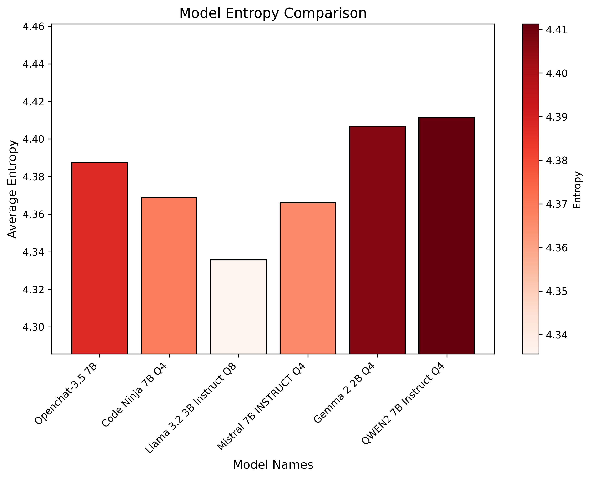
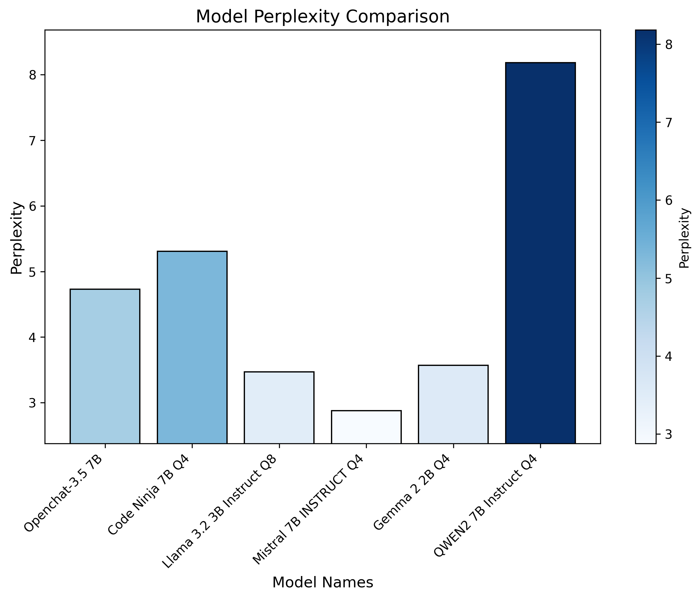

<table>
  <caption>
    Course Project Info
  </caption>
<tbody>
  <tr>
    <th>Code Repository URL</th>
    <td>https://github.com/uazhlt-ms-program/ling-582-fall-2024-course-project-code-digital-poets</td>
  </tr>
  <tr>
    <th>Demo URL (optional)</th>
    <td></td>
  </tr>
  <tr>
    <th>Team name</th>
    <td>Digital Poets</td>
  </tr>
</tbody>
</table>

## Project description

### Overview of Project

- In this project, we explored and compared how different open-source generative AI models compose poetry based on user-provided themes and prompts. Our goal is to assess how effectively these models produce poems that align with the intended themes, emotions and settings while maintaining creativity and coherence. We ensured that the poems sound natural and adhere to poetic conventions. By evaluating each model’s performance, we aimed to identify which models excel at generating poetry and highlight areas where improvements are needed.

### Description of its novelty

- The novelty of our project lies in comparing poems generated by different language models based on thematic prompts ,unlike regular text generation. It uniquely evaluates how models handle creativity, coherence and style within specific themes, using metrics like Self-BLEU, Distinct-2, Perplexity and Entropy to assess diversity and originality. Additionally, the analysis of syllabic structure and rhyming schemes provides insights into how well models maintain poetic forms. By focusing on the artistic quality of the generated text, the project expands the evaluation of language models beyond factual accuracy to creative content generation.

### Motivation for project

- The motivation for this project stems from a keen interest in exploring how AI can replicate and elevate creative human processes, such as poetry generation. By investigating the capabilities and limitations of language models in generating contextually rich and creative content, this project offers an opportunity to understand the potential of AI to mimic artistic expression. It also allows for a deeper analysis of how different prompts influence the creativity and diversity of generated poetry, providing valuable insights into both the technical and artistic aspects of AI-driven content creation.

### Discussion of related work

- Recent improvements in natural language processing (NLP) and AI have made it easier to generate poetry, but capturing the creativity and depth of human poets is still challenging. A study by Hugo Gonçalo Oliveira looks at different systems for generating poetry, examining aspects like language, features, techniques and how to measure the quality of poetry. It highlights the difficulty of judging poetry's emotional impact and subjective qualities and discusses both human evaluations and technical measures like BLEU and ROUGE. Another study, TPPoet by Amir Panahandeh and colleagues, focuses on a transformer-based model for Persian poetry. This model, using limited data and advanced techniques, creates poems that are more fluent, coherent and poetically strong than previous models, with 78% of its poems being rated as similar to those written by humans.
- Paper Link -
    1. _A Survey on Intelligent Poetry Generation: Languages, Features, Techniques, Reutilisation and Evaluation by Hugo Gonc¸alo Oliveira - (https://aclanthology.org/W17-3502.pdf)_
    2. _TPPoet: Transformer-Based Persian Poem Generation using Minimal Data and Advanced Decoding Techniques by Amir Panahandeh, Hanie Asemi, Esmaeil Nourani - (https://arxiv.org/abs/2312.02125)_

### Challenges of task

- Initially, we chose to work with models such as FLAN-T5, BART, BLOOM, GPT-2 and Reformer. However, these models struggled to generate poems from the given prompts. We also attempted to train them using a dataset of poems, but for most of the models, the outputs resembled generic text generation rather than actual poems. As a result, we transitioned to more advanced models, including Mistral, Code Ninja, OpenChat-3.5, Gemma and Qwen.
- With the new models in place, we decided to utilize the Jan UI for poem generation based on the prompts, as it provided a more efficient solution. This approach reduced the time and computational resources required compared to directly using the code.
- We implemented a restriction to ensure that each Python kernel file executes for a single model at a time. This decision was necessary because loading multiple models simultaneously for metrics calculations caused kernel crashes. Consequently, we created six separate Python files, each dedicated to processing one model individually.

### Discussion of SotA Approaches

- For this project we have used 6 models to generate poems. The models are described as below from Hugging Face-
    1. Llama 3.2 3B Instruct Q8 - Llama 3.2, developed by Meta, is a collection of multilingual large language models in 1B and 3B sizes, optimized for tasks like dialogue, retrieval and summarization. They outperform many models on industry benchmarks and use an optimized transformer architecture, fine-tuned with supervised learning and human feedback for improved helpfulness and safety.
    2. Mistral 7B INSTRUCT Q4 - The Mistral-7B-Instruct-v0.2 is a fine-tuned version of Mistral-7B-v0.2, optimized for instruction-following tasks. It features a 32k context window (up from 8k in v0.1), uses a Rope-theta of 1e6 and removes Sliding-Window Attention for improved performance.
    3. Gemma 2 2B Q4 - Gemma, developed by Google, is a family of lightweight, open-source text-to-text large language models, based on the technology behind the Gemini models. They offer pre-trained and instruction-tuned variants. Gemma is ideal for tasks like question answering, summarization and reasoning and their small size allows deployment on devices with limited resources, making advanced AI accessible to more users.
    4. QWEN2 7B Instruct Q4 - Qwen2 is a series of large language models ranging from 0.5 to 72 billion parameters, including instruction-tuned 7B models. It outperforms most open-source models and competes with proprietary ones in language understanding, generation, coding and reasoning. The Qwen2-7B-Instruct model supports up to 131,072 tokens for large inputs and uses a Transformer architecture with advanced features and an improved multilingual tokenizer.
    5. Openchat-3.5 7B - OpenChat is an open-source language model library fine-tuned with C-RLFT, achieving ChatGPT-like performance with a 7B model. It uses mixed-quality data without preference labels. To use it, install the OpenChat package and run the OpenAI-compatible API server on a consumer GPU with 24GB RAM.
    6. Code Ninja 7B Q4 - CodeNinja is an enhanced version of openchat-3.5-1210, fine-tuned on 400,000 coding instructions from extensive datasets. It’s designed to aid coders with advanced code completion and integrates seamlessly into coding workflows. Available in a 7B model size, CodeNinja supports a context window of

- The main goal is to have these models generate poems, then evaluate their quality using the following metrics:

    *	METEOR (Metric for Evaluation of Translation with Explicit ORdering): METEOR is designed to address some of the shortcomings of BLEU, particularly by considering synonyms, stemming, and word order.
    *	BLEU (Bilingual Evaluation Understudy): BLEU is a metric commonly used in machine translation. It measures the precision of n-grams (contiguous sequences of n words) in the generated text against a reference text.
    *	Perplexity: Definition: Perplexity measures how well a model predicts the next word in a sequence.
    *	Entropy: Entropy quantifies the average uncertainty or information content in the text. It measures the diversity or randomness in token distributions, such as characters or words, in the generated output.
    * Self-BLEU : Evaluates how much overlap exists between different samples generated by the same model.
    * Distinct n-grams: Measures the percentage of distinct n-grams in the generated text compared to the total n-grams. Higher distinctness means more diversity.
    * Rhyming Scheme - The rhyming scheme refers to the pattern of rhymes at the end of each line in the poem.
    * Syllable Count - This step focuses on counting the syllables in each line of the poem. In structured poetry like sonnets, the number of syllables per line is important.
    *	Lexical Diversity: Lexical diversity measures the range of unique words used in a text relative to the total number of words. 
    *	Readability Score: A readability score evaluates how easily a text can be understood by a reader, often based on sentence structure and word complexity. 
    *	Sentiment: Sentiment analysis is the process of determining the emotional tone behind a piece of text, typically classified as positive, negative, or neutral.

- Example Prompt - _Write a Shakespearean sonnet about courage set on a battlefield with a determined tone. Use vivid imagery to convey strength and resilience._
- By evaluating these aspects, we determined which models generate the most fitting and high-quality poems. 

## Timeline

* **Week 1 (Nov 04 - Nov 10):**
    * Finalize the project proposal and scope.
    * Set up GitHub repository and project environment.

* **Week 2 (Nov 11 - Nov 17):**
    * Generate different poems using the GPT-2 model based on various prompts with different themes, emotions and contexts.
    * Test and debug initial poetry generation.

* **Week 3 (Nov 18 - Nov 24):**
    * Generate different poems using the Reformer model based on various prompts with different themes, emotions and contexts.
    * Conduct initial evaluations of the generated poems.

* **Week 4 (Nov 25 - Dec 1):**
    * Analyze the results from the metrics.
    * Refine the poetry generation process.

* **Week 5 (Dec 2 - Dec 8):**
    * Compile final results and compare model performances.
    * Prepare the final report and presentation.
    * Submit the course blog post and project repository.

## Summary of individual contributions
<table>
  <thead>
  <tr>
    <th>Team member</th>
    <th>Role/contributions</th>
  </tr>
  </thead>
<tbody>
  <tr>
    <th><b>Poojitha Pasala</b></th>
    <td>Implemented and generated poems using Llama 3.2 3B Instruct Q8 and Mistral 7B INSTRUCT Q4, then evaluated the results to assess how well each model performs in creating creative and relevant poetry based on the given prompts. Also, worked on the metrics such as Entropy, Perplexity and visualization of the results.</td>
  </tr>
  <tr>
    <th><b>Sanjay Bhargav Siddi</b></th>
    <td>Implemented and generated poems using Gemma 2 2B Q4 and QWEN2 7B Instruct Q4, then evaluated the results to assess how well each model performs in creating creative and relevant poetry based on the given prompts. Also worked on the metrics such as cosine similarities, rhyming scheme, syllable counts and semantic analysis metrics.</td>
  </tr>
  <tr>
    <th><b>Swati Das</b></th>
    <td>Implemented and generated poems using Openchat-3.5 7B and Code Ninja 7B Q4, then evaluated the results to assess how well each model performs in creating creative and relevant poetry based on the given prompts. Also worked on metrics such as BLEU, METEOR, Self-BLUE and DISTINCT-N.</td>
  </tr>
</tbody>
</table>

## Results

| **Model**                        | **Lexical Diversity**  | **Readability Score** |
|----------------------------------|------------------------|-----------------------|
| 🏆 Code Ninja 7B Q4              | 0.69                   | 84.73                 |
| ✨ Gemma 2 2B Q4                 | 0.61                   | 76.60                 |
| 🤖 Llama 3.2 3B Instruct Q8      | 0.55                   | 69.97                 |
| 🚀 Mistral 7B INSTRUCT Q4        | 0.40                   | 80.11                 |
| 💬 Openchat-3.5 7B               | 0.69                   | 72.35                 |
| 🧠 QWEN2 7B Instruct Q4          | 0.74                   | 82.80                 |

- Observations:
    - Highest Lexical Diversity:
        - QWEN2 7B Instruct Q4 has the highest average lexical diversity at 0.74, suggesting it uses the most variety in vocabulary.
    - Highest Readability Score:
        - Code Ninja 7B Q4 has the highest average readability score at 84.73, indicating it is the easiest to read among the models listed.
    - Cosine Similarity:
        - Prompt ID 1: Models show high semantic similarity, with Mistral 7B INSTRUCT Q4, Code Ninja 7B Q4 and Gemma 2 2B Q4 closely aligned. Minor semantic divergence exists among other models.
        - Prompt ID 2: Models exhibit strong semantic alignment, with Code Ninja 7B Q4 and Gemma 2 2B Q4 having the highest similarity (0.72). Variance exists in other models, but the overall alignment is consistent.
        - Prompt ID 3: Openchat-3.5 7B and QWEN2 7B Instruct Q4 show the highest semantic similarity (0.81 and 0.80), while Mistral 7B INSTRUCT Q4 shows more semantic divergence (0.53–0.58) compared to others.

- Entropy(Bar Plot1):  
  - The entropy values indicate the level of uncertainty in the model's predictions, with lower entropy reflecting a more confident model. Based on the entropy values, **Llama 3.2 3B Instruct Q8** (entropy: 4.3356) performs the best, as it has the lowest entropy, suggesting it makes more confident predictions compared to the other models.

- Perplexity(Bar Plot2):  
  - The perplexity values represent how well the model predicts the next word, with lower perplexity indicating better performance. Based on the perplexity values, **Mistral 7B INSTRUCT Q4** (perplexity: 2.8783) performs the best, as it has the lowest perplexity, suggesting it has the highest accuracy in predicting the next word compared to the other models.

- Cosine Similarity(Heat Maps):  
  - Prompt ID 1: Models show high semantic similarity, with Mistral 7B INSTRUCT Q4, Code Ninja 7B Q4, and Gemma 2 2B Q4 closely aligned. Minor semantic divergence exists among other models.
  - Prompt ID 2: Models exhibit strong semantic alignment, with Code Ninja 7B Q4 and Gemma 2 2B Q4 having the highest similarity (0.72). Variance exists in other models, but the overall alignment is consistent.
  - Prompt ID 3: Openchat-3.5 7B and QWEN2 7B Instruct Q4 show the highest semantic similarity (0.81 and 0.80), while Mistral 7B INSTRUCT Q4 shows more semantic divergence (0.53–0.58) compared to others.

##  Final Observations:

1.  Creativity and Diversity:  
  - CodeNinja leads in Distinct-2 and Self-BLEU, followed closely by Openchat.

2. Fluency (Perplexity):  
  - Openchat outperforms the other models with the lowest perplexity values, indicating better fluency.

3.  Structural Adherence (Rhyme Scheme):  
  - Gemma best adheres to the Shakespearean sonnet structures, showcasing its structural accuracy.

 ## Conclusion:
- CodeNinja excels in diversity and originality, while Gemma is the best for structure-specific tasks. The optimal model depends on the key evaluation criterion for the task at hand.

## Error analysis

The error analysis identified key issues observed during the generative models' performance evaluation:
-	Lexical Diversity Issues: Repetition of common words and limited variety, especially in Mistral 7B and Llama 3.2 outputs.
-	Thematic Inconsistencies: Models struggled to maintain consistent adherence to the provided prompts and themes, likely due to prompt ambiguity and insufficient fine-tuning.
-	Poetic Structure Errors: Errors in maintaining rhyme schemes, syllabic rhythm and poetic cadence were evident in OpenChat-3.5 and Mistral 7B.
-	Semantic Drift: Models' outputs lost thematic coherence over longer sequences, likely due to limited context handling.
-	Readability vs Creativity Trade-off: High readability came at the cost of reduced creativity in models like Code Ninja 7B.
-	Rhyme Quality Issues: Attempts at rhyming were often inconsistent or forced, particularly in OpenChat-3.5 and Gemma 2 2B Q4.

## Reproducibility

- Follow the steps to create and access the models using personal token from Hugging Face - (https://huggingface.co/)
- Need the approval from the corresponding model admin team to access the model, which can be achieved by filling the required details.

## Future improvements

### Discussion of Limitations

- The models often have trouble creating poems that follow traditional rules, like rhyme schemes or syllable counts. Even though they are trained on large datasets, the poems they generate can sometimes lack coherence, emotional depth and variety. Also, there are not enough human-written poems available for certain topics, which makes it harder for the models to produce contextually rich poetry.

### Avenues for Improvement

- To make the models better at generating poems, we can use a wider range of prompts, including different themes, styles and forms, not just sonnets. This would help the model be more flexible and creative. Even though the models are trained on large datasets, they sometimes don’t follow the correct poem structure. To fix this, we can pre-train the models on a variety of datasets, including different types of literary works and poetry styles. This would help the models understand language patterns, structures and details better, resulting in poems that are more meaningful, coherent and correctly structured.