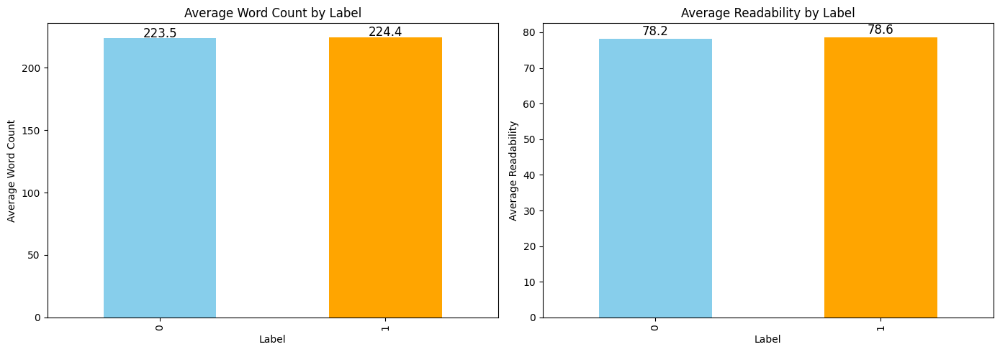
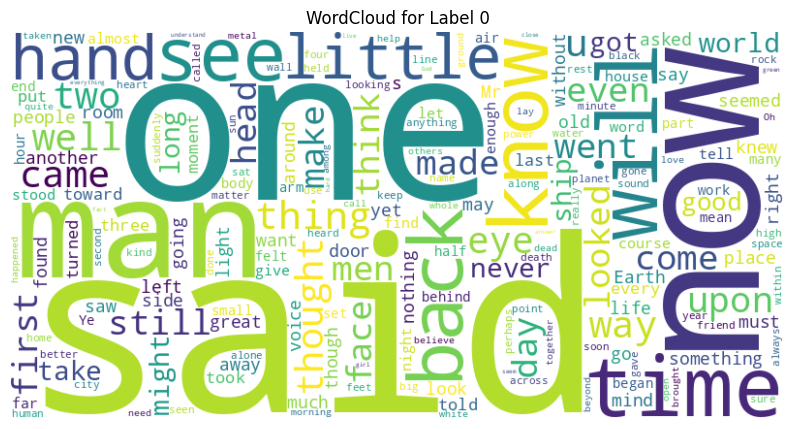
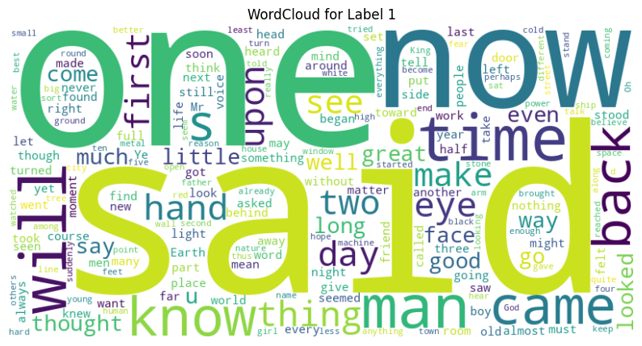

<table>
  <caption>
    Class Competition Info
  </caption>
  <thead>
  <tr>
    <th></th>
    <th></th>
  </tr>
  </thead>
<tbody>
  <tr>
    <th><b>Leaderboard score</b></th>
    <td>0.52182</td>
  </tr>
  <tr>
    <th><b>Leaderboard team name</b></th>
    <td>Sanjay Bhargav Siddi</td>
  </tr>
  <tr>
    <th><b>Kaggle username</b></th>
    <td>sanjaysiddi</td>
  </tr>
  <tr>
    <th><b>Code Repository URL</b></th>
    <td>https://github.com/uazhlt-ms-program/ling-582-fall-2024-class-competition-code-sanjaybhargavsiddi</td>
  </tr>
</tbody>
</table>


## Task summary

The task is to determine whether two spans of text were written by the same author. The spans are separated by a "[SNIPPET]" delimiter, and the goal is to classify them as either coming from the same author or different authors. The classification is binary, with the output being:

0: Not the same author

1: Same author

## Exploratory data analysis

### Label Counts

<div style={{ display: 'flex', justifyContent: 'center' }}>

</div>

The dataset shows a significant imbalance in label distribution:

* Label 0: 1245 instances (approximately 77.7% of the dataset).
* Label 1: 356 instances (approximately 22.3% of the dataset).

This imbalance indicates that Label 0 is much more prevalent, which could affect model training by potentially biasing predictions toward Label 0.

### Average Word Count

<div style={{ display: 'flex', justifyContent: 'center' }}>

</div>

* Label 1: 224.4 words per text on average.
* Label 0: 223.5 words per text on average.

The average word count is nearly identical between the two labels, suggesting that text length does not significantly differ based on the label.

### Average Readability

<div style={{ display: 'flex', justifyContent: 'center' }}>

</div>

* Label 0: 78.2 (Flesch Reading Ease score).
* Label 1: 78.6 (Flesch Reading Ease score).

Both labels have similar readability scores, indicating that the complexity of the text is comparable between the two classes


### Wordclouds

<div style={{ display: 'flex', justifyContent: 'center' }}>


</div>

The word clouds reveal the most frequently used words for each label, providing insights into distinct themes or topics associated with Label 0 and Label 1.

## Approach
To classify the SPANs and determine if they were written by the same author, patterns in writing style and language usage were analyzed. 

### Linguistic Feature Engineering
Extracting interpretable statistical features that are closely tied to writing style helped me increase my F1 score and help the model perform better in classification.

- Word Count: The total number of words provides insight into vocabulary usage and overall text length, which can vary between authors. Different authors have different word counts and vocabulary patterns that can be indicative of their style.
- Sentence Count: The number of sentences gives context about sentence structure and pacing, which are stylistic choices influenced by individual authors' writing habits.
- Lexical Diversity: Highlights differences in vocabulary usage patterns across authors by taking the ratio of unique words to repeated words.
- Readability Scores: Readability scores like Flesch Reading Ease evaluate how easy or difficult a text is to read based on sentence structure and vocabulary.

Together, these features provide a multi-dimensional view of an author's writing style.

### Sequence Modeling with LSTM/GRU and Pretrained Embedding Layer
Sequence models like LSTM (Long Short-Term Memory) and GRU (Gated Recurrent Unit) help capture temporal dependencies between words. These models are well-suited for modeling sequential relationships in text, capturing context-based patterns linked to distinct writing habits.

Language is inherently sequential, with meaning often relying on the context established by previous and subsequent words. Sequence models are capable of modeling these long-term dependencies:

- Embedding Layer: I incorporated pretrained word embeddings into the sequence models to capture semantic relationships like synonyms and stylistic trends. These embeddings provide semantic context, helping LSTM/GRU models better understand subtle contextual patterns in the text.
- LSTM (Long Short-Term Memory): Effective for capturing long-range word dependencies while maintaining context over long sequences.
- GRU (Gated Recurrent Unit): Faster to train and computationally efficient while offering similar performance for sequence prediction tasks.
- Bidirectional Sequence Modeling: Combining LSTM/GRU into bidirectional architectures allows the model to capture word dependencies in both forward (past-to-present) and backward (future-to-present) directions.

This multi faceted approach allows for a comprehensive analysis by leveraging both style-based indicators (statistical features) and context-aware temporal patterns (sequence models and embeddings), providing a more robust feature set to determine authorship similarity.
## Results
The F1 scores from the Kaggle leaderboard indicate that the Neural Networks model achieved an F1 score of 0.52182, outperforming the Logistic Regression model, which scored 0.4738. This demonstrates that the neural network model exhibited better performance in balancing precision and recall on the given dataset.

| Model               | F1 Score |
|---------------------|----------|
| Neural Networks     | 0.52182  |
| Logistic Regression | 0.4738   |

### Logistic Regression Classifier
The Logistic Regression classifier was applied to the training data, and the prediction outputs showed a strong class imbalance. The number of instances of each class was as follows:

* Number of 1s: 112
* Number of 0s: 787

This indicates that the 0 class is significantly more frequent in the dataset compared to the 1 class, highlighting the class imbalance problem that should be considered during model training or evaluation.

### Deep Neural Network
The Deep Neural Network (DNN) model was trained on the same dataset to investigate its performance compared to the Logistic Regression classifier. After training, the number of predicted classes was as follows:

* Number of 1s: 378
* Number of 0s: 521

This shows that the Deep Neural Network was able to make more balanced predictions compared to Logistic Regression, indicating its ability to capture nonlinear relationships and dependencies within the data.


## Error analysis

The EDA reveals that average word count and readability scores are nearly identical for both labels, indicating these features may not effectively aid classification. Both spans average around six sentences, with high lexical diversity (mean ≈ 0.7), reflecting rich vocabulary. However, the similar readability scores and negligible differences in text length and complexity suggest that these stylistic features are insufficient for distinguishing between the classes.
## Reproducibility

#### Clone the Repository:
 https://github.com/uazhlt-ms-program/ling-582-fall-2024-class-competition-code-sanjaybhargavsiddi.git

#### Install dependencies: 

```
pip install -r requirements.txt
```
#### Exploratory Data Analysis: 
Run the EDA.py file to generate EDA outputs (visualizations, word clouds, and statistics):

```
python EDA.py

```
This script calculates text style metrics (word count, lexical diversity, readability) for train.csv.
Outputs include:
* Bar charts of label counts.
* Word clouds for each label.
* Average word count and readability statistics.

#### Model Training and Prediction

Run the CodePred.py script to train the model and generate predictions:
```
python CodePred.py

```
* Prediction: Outputs predictions to output/submissionstyle.csv.
## Future Improvements

I will try to optimize model performance by experimenting with Transformer-based models and fine-tuning hyperparameters. I will enhance feature engineering by incorporating additional linguistic features and contextual embeddings to provide more insightful inputs to the model. To ensure better generalization, I will implement cross-validation techniques like K-fold cross-validation.