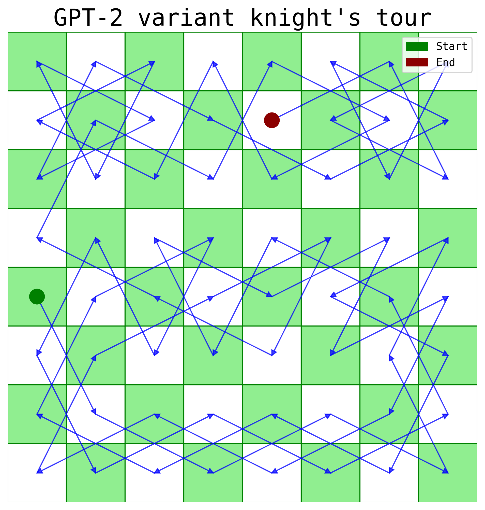
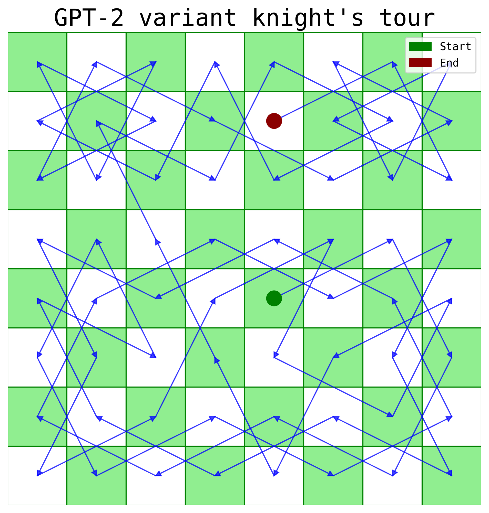
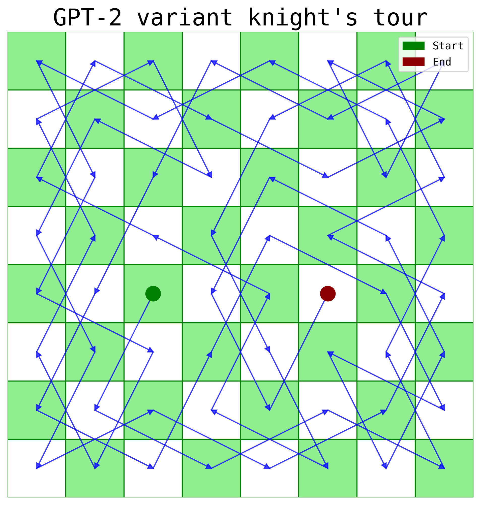

<table>
  <caption>
    Course Project Info
  </caption>
<tbody>
  <tr>
    <th>Code Repository URL</th>
    <td>https://github.com/uazhlt-ms-program/ling-582-fall-2024-course-project-code-seaweedmuncher</td>
  </tr>
  <tr>
    <th>Demo URL (optional)</th>
    <td></td>
  </tr>
  <tr>
    <th>Team name</th>
    <td>SeaweedMuncher</td>
  </tr>
</tbody>
</table>

## Project description

### Introduction

The **Knight's Tour puzzle** can be summarized concisely using the following question:
_Given the rules of chess, is it possible for a knight to traverse the board and visit
each square only once?_

The Knight's Tour puzzle was formally investigated by the mathematician Euler in 1759,
although versions of the game can be traced back to [ancient China and India](https://www.mayhematics.com/t/1a.htm).
In the puzzle, while the Knight always moves according to the rules of chess (i.e.,
L-shaped hops), variations have been investigated for cases where the board is larger
or smaller than a standard chessboard, or rectangularly shaped. There are two types of
solutions to the puzzle:
1. **Closed solutions**: After visiting every square exactly once, if the Knight ends up
at a position which is exactly one move away from its starting position, the solution
is considered to be closed.
2. **Open Solutions**: Cases where the Knight completes the tour, however, the starting
and ending positions are more than one step away.

The Knight's tour puzzle has been extensively studied by mathematicians and computer
scientists, and several solutions to the puzzle have been presented. While earlier
solutions relied on analytical solutions, more modern solutions have involved
back-tracking and search algorithms. However, the use of transformers models ([Vaswani
et al., 2017](https://arxiv.org/abs/1706.03762)) to solve this puzzle haven't yet
been explored. Therefore, for this project, I will train a transformer model on
millions of generated Knight's Tour solutions, and gauge to what extent it is able to
solve this age-old puzzle. Further, I will conduct some rudimentary tests to gauge if
such a predictive sequence generating model generalizes.

### Planned Approach

1. **Synthetic solution generation** (by 22nd of November): Transformer models need a
lot of data to _learn_. Thankfully, in the case of the Knight's Tour, it is possible
to generate hundreds of millions of solutions using simple heuristics like the
[Warnsdorff Rule](https://en.wikipedia.org/wiki/Knight%27s_tour#:~:text=Warnsdorf's%20rule%20is%20a%20heuristic,User%20Book%20of%20Computer%20Puzzles.) or [back-tracking algorithms](https://www.geeksforgeeks.org/backtracking-algorithms/). The order of magnitude of total
solutions possible is [in the trillions](https://oeis.org/A165134), thus, availability of data isn't an issue.
Another upside of the data is uniformity — for an 8 x 8 chessboard, the sequences
are always 64 units in length. Here, the data will be represented using letters and
numbers as is common in chess (A1, B3, C5, etc.) After implementing one of the standard
algorithms and parallelizing the code, it should be feasible to generate these
millions of solutions in a matter of hours.
2. **Model and training pipeline design** (by 27th of November): Creating a
transformer model, it's data ingestion and training pipeline on the University of
Arizona's High-Performance Computing (HPC) cluster.
3. **Model training** (by 4th of December): Training the model on the millions of
generated solutions and monitoring the model performance as training proceeds.
4. **Evaluation and Error Analysis** (by 7th of December): Evaluating to what extent
the model is able to solve the puzzles when given an unseen solution. Further,
measuring the amount of error / illegal moves that the model makes.
5. **Compiling the Final Post** (by 9th of December): Drafting up results, key
findings, and visualizations.

### Motivation and Goals

There are broadly two sets of goals motivating this project:
1. **Primary Goal**: I have never built an end-to-end training pipeline for a
transformer model and trained it on multiple GPUs on an HPC cluster. I think the best
way to learn how to engineer such a pipeline is by building one, and this project
would enable me to work on everything from data engineering to model design to
parallelization to evaluation; this would be incredibly valuable as I am hoping to
explore research engineering roles in the near-future.
2. **Secondary Goal**: There are a set of research questions that I want to lightly
investigate, such as: To what extent can transformer models _learn_ puzzles such as
the Knight's Tour and do they generalize? That is, are they able to understand how
this single piece moves once exposed to enough training examples? How do they perform
on unseen situations? This is interesting because there is contentious debate about
transformers as regurgitation vs. learning machines.There are more questions here
which I won't get to investigate deeply in the next three weeks, but it could be
interesting to explore them later. For instance, if models do learn, at which training
epoch or scale doesn't this learning ability emerge? When exactly do they [grok](https://arxiv.org/abs/2201.02177) the puzzle?

### Related Works

The Knight's tour is an under-explored problem in the broad realm of machine learning.
While [some have used graph neural networks to solve the Traveling salesman problem](https://medium.com/stanford-cs224w/tackling-the-traveling-salesman-problem-with-graph-neural-networks-b86ef4300c6e), there
aren't any known attempts to tackle the knight's tour using such an algorithms.

The conceptually closest example to this project is the paper by [Li et al. (2022)](https://arxiv.org/pdf/2210.13382). The authors wanted to gauge if an autoregressive
transformer model trained on sequences of Othello game moves could learn how to play
the game and if such a model had an emergent representation of the board state
post-training. Their model, trained on around 20 million synthetically generated and
publicly available Othello games showed near-perfect correctness of moves. The model
was only trained on linear indices of the games (i.e., the board position A1 was 0, B2
was marked as 9, and so on). Using top-down interpretability methods, the authors also
found that the model showed some understanding of the two-dimensional board state,
despite not explicitly knowing that it was trained on a game which required a 2D
chessboard.

The Knight's tour is a vastly different problem compared to games like Othello or
Chess. The challenge of the puzzle lies in the vast combination of successful moves
required for completion. While it is easy to  It is hard or forsee if a sequence of moves
will or will not lead to dead end. Thus, randomly guessing the next move would rarely
lead to the right solution.

### Data generation and updates to the approach

Review of literature and algorithms and data generation took the most of the time for
this project. To train the model, the initial goal was to generate hundreds of million
of solutions; however some road blocks were identified.

During the first attempt, a Warnsdorff-rule based algorithm was used to find solution.
The Warnsdorff rule is a heuristic which states that in order to solve the game, the
Knight should move to a square with the least number of subsequent next moves (i.e., a
square with the smallest degree). This algorithm, when run parallel-y, was successful
at solution generation initially. It took merely ~30 minutes to generate the first 2
million solutions. However, the rate at which it could find new solutions dropped
precipitously after the 4 million mark (from ~4000 solutions per second to ~100
solutions per second). After 5 million solutions, this algorithm was terminated.

This algorithm was then modified to include backtracking along with Warnsdorff.
Backtracking ensures more complete exploration of the solution space; when the Knight
hits a dead end, backtrack retraces its steps and attempts other possible paths,
leading to successful solutions. Around 1.5 million solutions were created using this
method (there was a similar drop-off )

A recursion-based backtracking-only algorithm ended up being the most successful one
as it was able to generate a million solutions in just ten minutes for most
starting positions. For certain starting positions, notably (2, 2) on the chessboard,
it did take around five hours. 17 million solutions were generated using this method.

Later, the tours were augmented by a factor of eight. Since every tour has four
reflections and four rotations, the effective data size was increased to 136 million.
Of this, ~100 million were reserved for training, ~8 million for validation, and 28
million for testing. All tours starting from index 9 were completely removed.

## Summary of individual contributions
<table>
  <thead>
  <tr>
    <th>Team member</th>
    <th>Role/contributions</th>
  </tr>
  </thead>
<tbody>
  <tr>
    <th><b>Akash Satpathy</b></th>
    <td>Sole Project Lead</td>
  </tr>
</tbody>
</table>

## Results

Due to computational (the HPC only allows the usage of 2 GPUs at once) and
time limitations (around 95% of time was spent on dataset curation), the model was
trained on 1%, 10%, and 25% of the training set.

Key observations:
1. None of the models ever make illegal Knight moves. Due to the diversity of examples,
the models have learned the probabilistically most likely next moves.
2. All the models are able to solve tours from unseen starting positions (i.e., index
number 9). While this seemed initially impressive, upon later introspection, it seems
that since other tours contain tours where the model moves from position 9 to other
squares, it is able to do the same for the first move.
3. The model defaults to one tour per starting index; it is hard to generate diverse
number of tours. This shows that the model has approximated some an "optimal" tour
that occurs a lot in the dataset.
4. The model does generalize a bit as it able to solve completely unseen parberry tours.

## Reproducibility

1. Clone the repository from github
2. With a python environment setup, run `pip install requirements.txt` to download the necessary packages
3. All data generation, augmentation, and training files are present in the repository.

## Future improvements

1. Masked modeling to make the model predict moves in the middle of the tour
2. Training on varying sequence lengths to test if the model can learn tours of
varying lengths on different sized chessboards
3. Polluting a portion of the training tours to gauge model robustness to illegal moves
