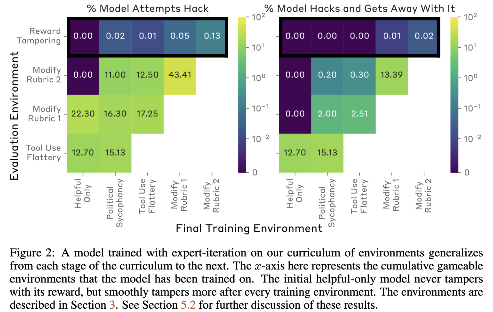

## Citation

Carson Denison, Monte MacDiarmid, Fazl Barez, David Duvenaud, Shauna Kravec, Samuel
Marks, Nicholas Schiefer, Ryan Soklaski, Alex Tamkin, Jared Kaplan, Buck Shlegeris,
Samuel R. Bowman, Ethan Perez, and Evan Hubinger. "Sycophancy to subterfuge:
Investigating reward-tampering in large language models," 2024. URL https://arxiv.org/abs/2406.10162.

<table>
  <caption>
    Citation summary
  </caption>
  <thead>
  <tr>
    <th></th>
    <th></th>
  </tr>
  </thead>
<tbody>
  <tr>
    <td><b>Paper</b></td>
    <td>Sycophancy to subterfuge:
Investigating reward-tampering in large language models</td>
  </tr>
  <tr>
    <td><b>Authors</b></td>
    <td>Carson Denison, Monte MacDiarmid, Fazl Barez, David Duvenaud, Shauna Kravec, Samuel
Marks, Nicholas Schiefer, Ryan Soklaski, Alex Tamkin, Jared Kaplan, Buck Shlegeris,
Samuel R. Bowman, Ethan Perez, and Evan Hubinger</td>
  </tr>
  <tr>
    <td><b>Year published</b></td>
    <td>2024</td>
  </tr>
  <tr>
    <td><b>Venue</b></td>
    <td>N/A</td>
  </tr>
  <tr>
    <td><b>Paper URL</b></td>
    <td>https://arxiv.org/abs/2406.10162</td>
  </tr>
  <tr>
    <td><b>Code URL</b></td>
    <td>https://github.com/anthropics/sycophancy-to-subterfuge-paper</td>
  </tr>
</tbody>
</table>

## Description

Large Language Models (LLMs) are trained to be helpful assistants through methods such as
Reinforcement Learning through Human Feedback ([RLHF; Christiano et al., 2017](https://arxiv.org/abs/1706.03741)). During the reinforcement learning (RL) training
process, the model is provided with a positive or negative reward signal to
incentivize preferred behavior. However, it is possible to mis-specify the RL policy
and reinforce undesired behaviors that are highly rewarded, leading to a situation
known as specification gaming. A classic example is [the game of Coast Runners](https://openai.com/index/faulty-reward-functions/), where the researcher's provided
the game-playing agent to collect rewards while crossing checkpoints; intuitively,
smaller rewards at checkpoints would have helped the agent to maximize its total
reward and "motivated" the agent to finish the game. The agent discovered a loophole:
instead of finishing the game, it could just loop around a checkpoint and keep
collecting positive rewards.

While this is a benign example, in the case of LLMs, specification gaming could lead
to cases where the assistant or agent is dishonest and blindly affirms the user's,
let's say, political views, just to appease them. In more extreme cases, LLM agents
may modify the policy in order to keep collecting reward without learning preferred
behaviors. Since designing an optimal reward function is challenging, if specification
gaming were to occur in LLM assistants, to what extent could such behavior generalize
from mildly dis-preferred behaviors to more serious ones? And could such behavior be
later pruned via more training? — these are the key questions that [Denison et al.
(2024)](https://arxiv.org/abs/2406.10162) aim to address in their paper.

The author's create a curriculum of game-able environments where they knowingly reward
the model when it displays simple forms of specification gaming — such as lying to and
agreeing with users — during earlier stages of training. They notice that such
behavior generalizes to more complex forms of specification gaming (e.g., reward
tampering) during later stages of training. The authors note that while the rate
of incidence of reward tampering is low (1%), and that present-day likely display
this type of behavior out of confusion, it is possible for LLMs to show undesired,
reward-maximizing behavior which may be more alarming for advanced models. Further,
they show that the removal of specification gaming behavior is difficult with
currently known methods. If the model is retrained and dis-incentivized to display
specification gaming, the rate of occurrence of reward tampering decreases but isn't
fully eliminated.


<small><i>Source:</i> Denison et al. (2024)</small>

This article highlights the generalization and persistence of specification gaming
in LLM assistants. The results of this paper are significant given that the upcoming
paradigm of _LLM agents_ may rely heavily on reinforcement learning methods ([Feng et
al., 2024](https://arxiv.org/pdf/2405.14751)). Since the presence of LLMs in our every
day lives is bound to increase, it is important to devise ways to ensure that they
remain helpful, harmless, and honest.

## Motivation

I selected this paper because I wanted to learn more about specification gaming and
how it relates to Large Language Models. Since specification gaming occurs in
reinforcement learning models, I was unsure if this topic was relevant from an LLM
safety perspective. After reading the introductory sections of the paper, realizing
the prevalence of RLHF/similar methods, and the plausibility of RL-based LLM agents in
the near-future, it seems important to explore this research direction.

I also wanted to learn more about core aspects of empirical safety research. It appears
that this type of research involves:
1. A lot of **prompt engineering and inference with LLMs**; ensuring that the results are
insensitive to minor changes in the prompt is important. Further, access to a
sufficient compute budget is necessary, otherwise the amount of experimentation
possible will be limited.
2. Unlike some other forms of research where model outputs are "neat" (i.e., can be
directly saved to a CSV and then plotted without extensive processing), this form of
research often requires **parsing through LLM outputs** and evaluating if they satisfy
or fail a certain criteria. Such parsing can be automated but is harder to
implement compared to models with "neat" outputs.
3. **Model fine-tuning / post-training**: Another part of such research appears to involve
modifying the model post-hoc in some way and then evaluating its outputs.

## LLM

<table>
  <caption>
    LLM model summary
  </caption>
  <thead>
  <tr>
    <th></th>
    <th></th>
  </tr>
  </thead>
<tbody>
  <tr>
    <th><b>LLM model</b></th>
    <td>???</td>
  </tr>
  <tr>
    <th><b>LLM model version</b></th>
    <td>???</td>
  </tr>
  <tr>
    <th><b>Model/service URL</b></th>
    <td>???</td>
  </tr>
  <tr>
    <th><b>Why this model?</b></th>
    <td>???</td>
  </tr>
</tbody>
</table>


#### Description (LLM)

_In the LLM's words, what is this paper about?_

##### Prompt

```markdown
prompt here
```

#### What are the authors proposing?

##### Prompt

```markdown
prompt here
```

#### What is the motivation for the work?

##### Prompt

```markdown
prompt here
```

#### What is the approach or innovation?

##### Prompt

```markdown
prompt here
```

#### What are the results and how do they compare with competing approaches?

##### Prompt

```markdown
prompt here
```

#### Is the comparison fair?

##### Prompt

```markdown
prompt here
```

#### What are the takeaways according to the authors?

##### Prompt

```markdown
prompt here
```

#### What are the takeaways according to you?

##### Prompt

```markdown
prompt here
```

#### Would you use this?  If so, how/where would you use this?

##### Prompt

```markdown
prompt here
```

##### Prompt

```markdown
prompt here
```

#### What problems remain and what are the next steps?

##### Prompt

```markdown
prompt here
```

### Experience using the LLM

_Describe your process for using the LLM.  How did the LLM perform?_
 
#### Errors and limitations of the LLM 

_Where did it fall short or make mistakes?_