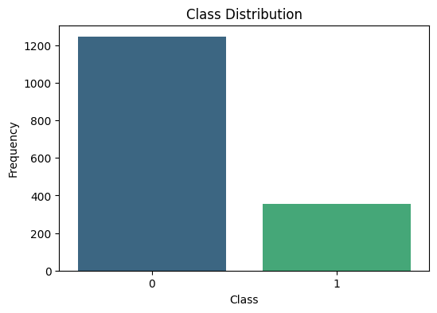
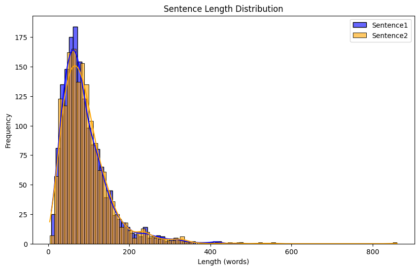
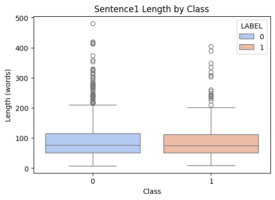
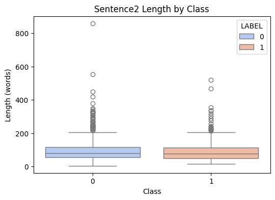

<table>
  <caption>
    Class Competition Info
  </caption>
  <thead>
  <tr>
    <th></th>
    <th></th>
  </tr>
  </thead>
<tbody>
  <tr>
    <th><b>Leaderboard score</b></th>
    <td>0.54078</td>
  </tr>
  <tr>
    <th><b>Leaderboard team name</b></th>
    <td>Vamsi Vadala</td>
  </tr>
  <tr>
    <th><b>Kaggle username</b></th>
    <td>vamsi05vadala</td>
  </tr>
  <tr>
    <th><b>Code Repository URL</b></th>
    <td>https://github.com/uazhlt-ms-program/ling-582-fall-2024-class-competition-code-Vamsi-Vadala</td>
  </tr>
</tbody>
</table>


## Task summary

### **Task Description**  
This task involves **binary sentence-pair classification**, where the goal is to predict whether two sentences have a particular semantic relationship (e.g., entailment, contradiction, or similarity). The dataset contains pairs of sentences (`Sentence1` and `Sentence2`) extracted from a larger corpus, labeled as `1` (positive) or `0` (negative).  

- **Label Space**: Binary classification (`0` or `1`).
- **Dataset Size**:
  - Training Dataset: Total samples = `2000`.
  - Class distribution: Analyzed using the `value_counts()` method for balance.
- **Design**: I've used a pre-trained BERT model, which I fine-tuned for this classification task. Sentence pairs are tokenized, fed into BERT, and the CLS token's embedding is used for prediction via a custom linear head.

---


### **Challenges of the Task**  
1. **Data Imbalance**:
   - Class imbalance : The data is slightly imbalanced. There are more `0`'s than `1`'s causing the accuracy of the trained model to be lower.

3. **Length Disparities**:
   - BERT truncates sentences longer than 128 tokens, potentially losing important information.
   - Example: Some long sentences when truncated causes misrepresentation in their meaning in the tokenized form.

---

## Exploratory data analysis

### Dataset Overview

The following is the Dataset overview after splitting data into two sentences. You can get this output from the running the jupyter-notebook from the git repository.
```
Dataset Overview:
<class 'pandas.core.frame.DataFrame'>
RangeIndex: 1601 entries, 0 to 1600
Data columns (total 5 columns):
 #   Column     Non-Null Count  Dtype 
---  ------     --------------  ----- 
 0   ID         1601 non-null   int64 
 1   TEXT       1601 non-null   object
 2   LABEL      1601 non-null   int64 
 3   Sentence1  1601 non-null   object
 4   Sentence2  1601 non-null   object
dtypes: int64(2), object(3)
memory usage: 62.7+ KB
None

Sample Data:
   ID                                               TEXT  LABEL  \
0   0  When his speaker remained silent Dirrul assume...      0   
1   1  If she had only come to me and said she desire...      0   
2   2  He took a step to a little mound of good grass...      0   
3   3  The light of the torch flared more brightly. P...      0   
4   4  "It's platinum," Carstairs said. Tim Carstairs...      0   

                                           Sentence1  \
0  When his speaker remained silent Dirrul assume...   
1  If she had only come to me and said she desire...   
2  He took a step to a little mound of good grass...   
3  The light of the torch flared more brightly. P...   
4  "It's platinum," Carstairs said. Tim Carstairs...   

                                           Sentence2  
0   How big is a spation in space?" "Van Manderpo...  
1   Daddy was always shushing her.... But who was...  
2   Do you mind if I stroke one of your paws—hand...  
3   And, despite the strangeness of their surroun...  
4   You'd think that after a year I would have re...  
``` 
The `TEXT` column contains two sentences separated by `[SNIPPET]` in the following form:
 - `Sentence1` `[SNIPPET]` `Sentence2`

where the two sentences are either from the same author or different authors.

The `LABEL` has two values:
  - `0` - Not the same author
  - `1` - Same author

### Dataset Size:
Total Samples: 1601

```
Class Distribution:
LABEL
0    1245
1     356
Name: count, dtype: int64
```
### Class Distribution
<figure>  </figure>

### Example Sentence Pairs


```
Example Sentence Pairs:
Sample 6:
  Sentence1: Everybody knows that squixes live in xixxix trees and everybody knows that squixes are collectors. They collect all sorts of things, buttons and pins and twigs and pebbles—anything at all, in fact, that isn't too big for them to pick up and carry into their xixxix tree houses. They have been called less kind things than collectors. Thieves, for example, and scavengers. But collectors are what they really are. Collecting fulfills a basic need in their mammalian makeup; the possession of articles gives them a feeling of security. They love to surround their little furry bodies with all sorts of odds and ends, and their little arboreal houses are stuffed with everything you can think of. And they simply adore paper. 
  Sentence2:  In it was a watch ... but, what a watch! Besides the regulation Terran dial, it had a second smaller dial that registered the corresponding time on Mars. Tommy's whole heart went out to it in an ecstasy of longing. He thought wistfully that if you could know what time it was there, you could imagine what everyone was doing and it wouldn't seem so far away. Haltingly, he tried to explain. "Look, Mom," he said breathlessly. " It's almost five o'clock at home. Douwie will be coming up to the barn to be fed.
  Label: 0

Sample 7:
  Sentence1: There was no man from whom he kept fewer secrets than Mr. Guest; and he was not always sure that he kept as many as he meant. Guest had often been on business to the doctor’s; he knew Poole; he could scarce have failed to hear of Mr. Hyde’s familiarity about the house; he might draw conclusions: was it not as well, then, that he should see a letter which put that mystery to right? and above all since Guest, being a great student and critic of handwriting, would consider the step natural and obliging? The clerk, besides, was a man of counsel; he could scarce read so strange a document without dropping a remark; and by that remark Mr. Utterson might shape his future course.  “This is a sad business about Sir Danvers,” he said.  “Yes, sir, indeed. 
  Sentence2:  Suddenly it flashed upon me that my superior was a confirmed hater of unmarried women. I had clean forgotten it; and now the full import of what I had done scared me silent. "Is anything the matter?" asked Miss Barrison. "No—not yet," I said, ominously. How on earth could I have overlooked that well-known fact. The hurry and anxiety, the stress of instant preparation and departure, had clean driven it from my absent-minded head. [120]Jogging on over the sand, I sat silent, cudgelling my brains for a solution of the disastrous predicament I had gotten into. I pictured the astonished rage of my superior—my probable dismissal from employment—perhaps the general overturning and smash-up of the entire expedition.
  Label: 0

Sample 8:
  Sentence1: gasped Robbins, and without a word he turned and fled, leaving the Nice Girl transfixed with astonishment and staring after him with a frown on her pretty brow.  “What does he mean by such conduct?” she asked herself. But Robbins disappeared from the gathering throng in the large room of the hotel, dashed down the steps, and hurried along the narrow pavements toward the “Golden Dragon.” The proprietor was standing in the hallway with his hands behind him, a usual attitude with the Dragon.  “Where,” gasped Robbins, “is Mr.—Mr.——” and then he remembered he didn’t know the name. “ 
  Sentence2:  This story differs from others in having an assortment of morals. Most stories have one moral; here are several. The moral usually appears at the end—in this case a few are mentioned at the beginning, so that they may be looked out for as the reading progresses. First: it is well for a man—especially a young man—to attend to his own business. Second: in planning a person’s life for some little distance ahead, it will be a mistake if an allowance of ten per cent. at least, is not made for that unknown quantity—woman. Third: it is beneficial to remember that one man rarely knows everything.
  Label: 1

Sample 9:
  Sentence1: "What shall we do now, Major? Walk? Maybe your nose can smell out another friend for us." They had gone hardly two blocks when it came to him that there was a more useful way of spending their time. The library! 
  Sentence2:  It knocked him down. Before he could get his breath, a red, wet tongue was licking his face and hands, and he was looking up into the face of a police dog! Frantic with joy at seeing another in this city of death, the dog would scarcely let Miller rise. It stood up to plant big paws on his shoulders and try to lick his face. Miller laughed out loud, a laugh with a throaty catch in it. "Where'd you come from, boy?" he asked. " Won't they talk to you, either? What's your name, boy?"
  Label: 1
```

### Text Diversity:

Sentence1 - Total Words: `146125`, Unique Words: `27443`, Lexical Diversity: `0.19`

Sentence2 - Total Words: `150470`, Unique Words: `28117`, Lexical Diversity: `0.19`

### Sentence Length Distribution

<figure>  </figure>

### Boxplot

<figure>  </figure>
<figure>  </figure>

You can see there are outliers with sentence length of 800. Where BERT can only take a maximum of 512.
## Approach

### **Description of the Approach**
This project implements a **binary sentence-pair classification task** using a **fine-tuned BERT model**. The approach involves the following key components:  

1. **Data Preprocessing**:  
   - Sentence pairs are extracted and tokenized using BERT's tokenizer. 
   - Padding and truncation are used to ensure consistent input length.

2. **Model Architecture**:  
   - **Pre-trained BERT Backbone**: A `bert-base-cased` model is used for its strong contextual understanding.  
   - Binary Cross-Entropy with Logits Loss (`BCEWithLogitsLoss`) is used, allowing the model to output unbounded logits that are later converted to probabilities.

3. **Training Strategy**:  
   - **AdamW Optimizer**: Used for better weight regularization.  
   - **Learning Rate**: A low learning rate (`2e-5`) ensures fine-tuning without overfitting the pre-trained weights.  
   - **Batch Size**: A moderate batch size of 16 balances memory usage and training efficiency.  
   - Multiple epochs (6) allow gradual convergence. Can be increased but might overfit the model. Should've used early-stopping but data size is smaller and separating validation set causes accuracy issues.
---

### **Motivation for the Approach**
- **BERT**: Chosen for its ability to capture contextual information in text, which is critical for tasks involving semantic relationships between sentence pairs.  
---

### **Key Takeaways**  
1. **Efficient Tokenization for Sentence Pairs**:  
   The tokenizer uses `longest_first` truncation and concatenates sentence pairs effectively, ensuring that no crucial information is lost during preprocessing.  

2. **Custom Prediction Pipeline with Dataset Class**:  
   A `PredictionDataset` is implemented to handle custom ID-based data, making the approach modular and reusable for diverse input structures.  

3. **Balanced Optimization**:  
   Weight decay (`0.01`) is incorporated in the optimizer to prevent overfitting, a common issue in fine-tuning pre-trained models on small datasets.  

---

## Results

- This model performed pretty average because of the class imbalance and token length issues causing model to perform poorly.
- The model gave a score of `0.54078`. (slightly better than tossing a coin and choosing 😞.) 


## Error analysis

### Classification Report:
```
              precision    recall  f1-score   support

     Class 0       0.83      0.97      0.89       132
     Class 1       0.33      0.07      0.11        29

    accuracy                           0.81       161
   macro avg       0.58      0.52      0.50       161
weighted avg       0.74      0.81      0.75       161
```
The results highlight significant issues in your classification model, particularly regarding the imbalance between the two classes and the difficulty in predicting Class 1 correctly.

### **Classification Metrics Analysis**
- **Precision**:
  - Class 0: 0.83 (fairly good; most of the predictions for Class 0 are correct).
  - Class 1: 0.33 (poor; only a third of predictions for Class 1 are correct).
- **Recall**:
  - Class 0: 0.97 (excellent; almost all actual Class 0 samples are identified correctly).
  - Class 1: 0.07 (very poor; the model struggles to identify actual Class 1 samples).
- **F1-Score**:
  - Class 0: 0.89 (reflects strong performance for Class 0).
  - Class 1: 0.11 (indicates that predictions for Class 1 are highly unreliable).

The overall accuracy is 81%, but this is misleading due to the heavy skew towards Class 0. Metrics like **macro-average** (F1 = 0.50) and **weighted average** (F1 = 0.75) give a more balanced perspective.

---


### **Error Analysis: Misclassified Examples**
```
Misclassified Examples:
Sentence1: Rarely." "Love me?" "Once in a blue moon." "What would I have to do for you to want to marry me?" "Amount to something." "I like that. Don't you think I amount to something now? Women swoon at the sight of my face on the screen, and come to life again at the sound of my voice." "The women who swoon at you will swoon at anybody. 
Sentence2:  I put my shoulder to the door and had no trouble at all. The explosion, or whatever it was, must have weakened the hinges. As the door crashed in, I looked for Perry. There was no sign of him. But I could see his shoes, on the floor in front of that TV tube, where he must have been standing. No feet in them, though, just his socks. All the high-voltage stuff was smoking. The TV screen was all lit up, and on it I could see a girl's face, the same girl whose picture Perry had shown me.
True Label: 1, Predicted Label: 0.0

Sentence1: Reason had left me. When it returned I was far out at sea in our boat wholly estranged from civilization. A day later I was picked up by the schooner in which I came to Port Moresby.  "I have formed a plan; you must hear it, Goodwin—" He fell upon his berth. I bent over him. 
Sentence2:  "Not what you seem to think, Dr. Goodwin," he answered at last, gravely. " Let me sleep over it. One thing of course is certain—you and your friend Throckmartin and this man here saw—something. But—" he was silent again and then continued with a kindness that I found vaguely irritating—"but I've noticed that when a scientist gets superstitious it—er—takes very hard!  "Here's a few things I can tell you now though," he went on while I struggled to speak—"I pray in my heart that we'll meet neither the Dolphin nor anything with wireless on board going up. Because, Dr. Goodwin, I'd dearly love to take a crack at your Dweller.  "And another thing," said O'Keefe. "
True Label: 1, Predicted Label: 0.0

Sentence1: I have many on file in the Neuropsychiatorium. Just go and take your pick. However, I will give you one ad lib and sub rosa. There is more downstairs than Professor Zalpha dreams about. Who is he to say there is no civilization in inner space as well as outer? How do we know that there is not a globe inside a globe with some kind of space or atmosphere in between?" Exmud R. Zmorro says thanks and leaves in quite a hurry. 
Sentence2:  Or Beelzebub." All at once we hear a big rumbling noise and the plexidomed house we are in shakes and rattles and we are knocked out of our chairs and deposited on the seats of our corylon rompers. The viso-screen blacks out, I get to all fours and ask, "You think the Nougatines have gone to war again, D'Ambrosia?" "It was not mice," Zahooli gulps. " It is either a hydroradium plant backfired or a good old-fashioned earthquake."
True Label: 1, Predicted Label: 0.0

Sentence1: He called me Old Crony, as I used to come to him in the field and follow him about. Sometimes he brought his grandfather, who always looked closely at my legs.  “This is our point, Willie,” he would say; “but he is improving so steadily that I think we shall see a change for the better in the spring.”  The perfect rest, the good food, the soft turf, and gentle exercise, soon began to tell on my condition and my spirits. I had a good constitution from my mother, and I was never strained when I was young, so that I had a better chance than many horses who have been worked before they came to their full strength. During the winter my legs improved so much that I began to feel quite young again. The spring came round, and one day in March Mr. Thoroughgood determined that he would try me in the phaeton. I was well pleased, and he and Willie drove me a few miles. My legs were not stiff now, and I did the work with perfect ease. 
Sentence2:  “I beg your pardon, sir,” he said, “but I think there is something the matter with your horse; he goes very much as if he had a stone in his shoe. If you will allow me I will look at his feet; these loose scattered stones are confounded dangerous things for the horses.”  “He's a hired horse,” said my driver. “ I don't know what's the matter with him, but it is a great shame to send out a lame beast like this.”  The farmer dismounted, and slipping his rein over his arm at once took up my near foot.  “Bless me, there's a stone! Lame! I should think so!”  At first he tried to dislodge it with his hand, but as it was now very tightly wedged he drew a stone-pick out of his pocket, and very carefully and with some trouble got it out.
True Label: 1, Predicted Label: 0.0

Sentence1: It must be remembered, however, that in the gaseous experiments the gases occupy all the space o, o, (fig. 104.) between the inner and the outer ball, except the small portion filled by the stem; and the results, therefore, are twice as delicate as those with solid dielectrics. 1294. The insulation was good in all the experiments recorded, except Nos. 10, 15, 21, and 25, being those in which ammonia was compared with other gases. 
Sentence2:  Philosophical Transactions, 1825, p.440. As a curious illustration of the influence of mechanical forces over chemical affinity, I will quote the refusal of certain substances to effloresce when their surfaces are perfect, which yield immediately upon the surface being broken, If crystals of carbonate of soda, or phosphate of soda, or sulphate of soda, having no part of their surfaces broken, be preserved from external violence, they will not effloresce. I have thus retained crystals of carbonate of soda perfectly transparent and unchanged from September 1827 to January 1833; and crystals of sulphate of soda from May 1832 to the present time, November 1833. If any part of the surface were scratched or broken, then efflorescence began at that part, and covered the whole. The crystals were merely placed in evaporating basins and covered with paper. In reference to this paragraph and also 626, see a correction by Dr. C. Henry, in his valuable paper on this curious subject. Philosophical Magazine, 1835. vol. vi.
True Label: 1, Predicted Label: 0.0
```
The misclassified examples provide qualitative insights:

1. **Long and complex sentences**:
   - Some of the above example sentences are long, intricate narratives or technical explanations. These exceed the model's effective attention span, leading to truncation or poor feature extraction despite tokenization.
   
2. **Semantic Disconnection**:
   - Sentence pairs are often semantically disparate, making it harder for the model to detect a logical or thematic connection. This disconnect could cause the model to misclassify these as unrelated (Class 0).

3. **Class 1 is challenging**:
   - Many of the true Class 1 samples are misclassified as Class 0. This suggests the model struggles to learn meaningful patterns specific to Class 1.

4. **Data Imbalance**:
   - With only 29 Class 1 samples versus 132 Class 0 samples, the model is likely biased toward predicting Class 0.

---


## Reproducibility

You can find how to run the notebook here.

https://github.com/uazhlt-ms-program/ling-582-fall-2024-class-competition-code-Vamsi-Vadala/blob/main/README.md
